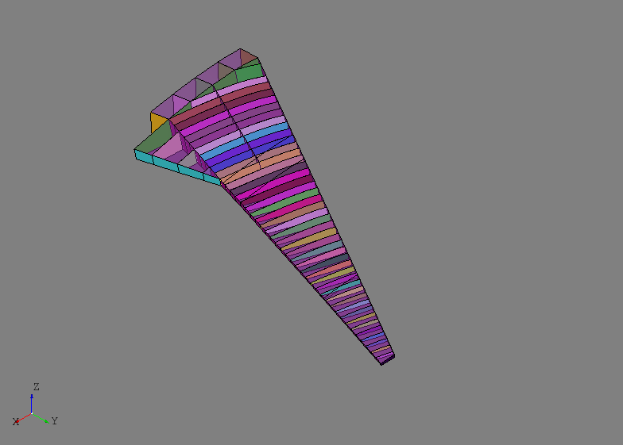
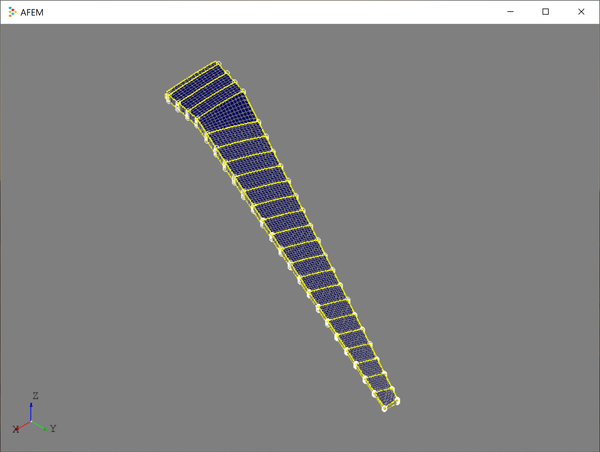
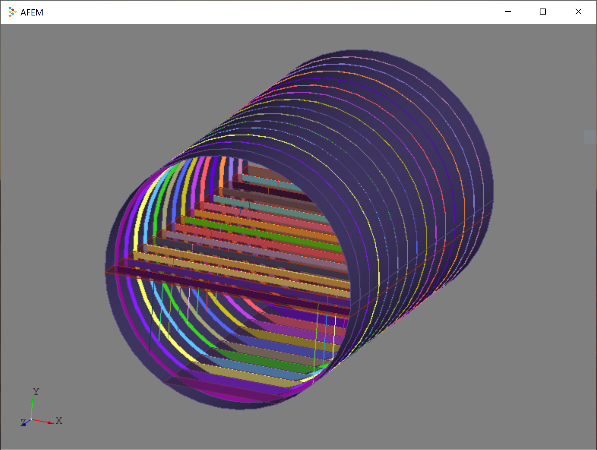
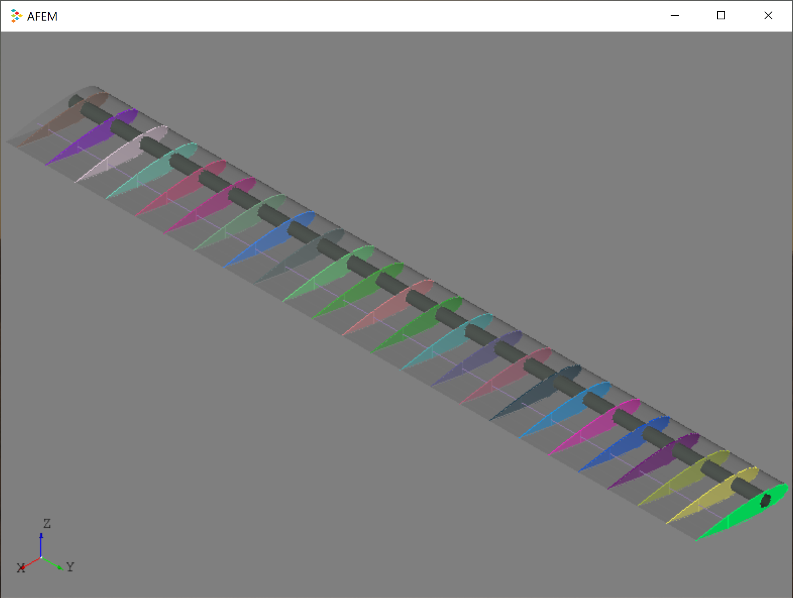
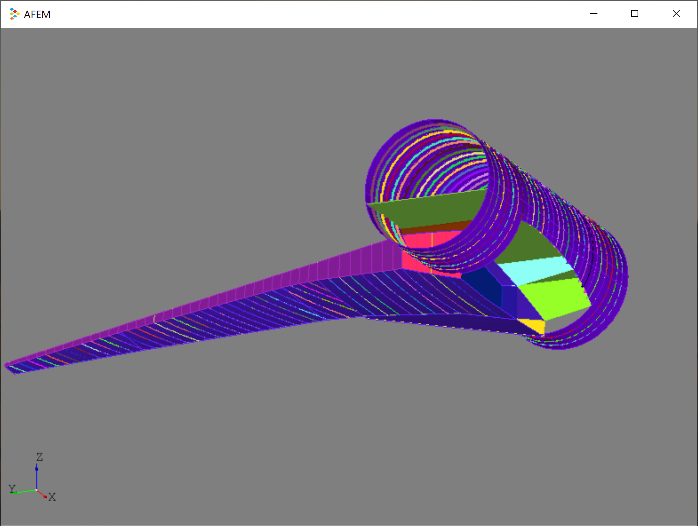

# AFEM — Airframe Finite Element Modeler

AFEM is a "fit-for-purpose" engineering development toolkit designed to support
the use of high-order structural analysis during the early phases of aircraft
conceptual design. As a development toolkit, it provides the engineer with a
flexible, modular, and extensible library of components and tools to rapidly
build a useful structural model. It is **not** an end-user GUI application, but
rather a library enabling engineers to rapidly build their own application
specific tools and processes, encoding their own design rules and best
practices along the way.

Although AFEM targets airframe design and analysis applications, really only
the ``afem.structure`` and ``afem.oml`` packages directly support that cause.
All the other packages provide a more general and "Pythonic" set of entities
and tools that could potentially be used to develop applications in other
disciplines and/or domains.

## Getting started using conda
[Conda packages](https://anaconda.org/trelau/dashboard/) are
available for a number of platforms and Python versions. Get started with:

    conda create -n afem python=3.8
    activate afem
    conda install -c conda-forge -c trelau afem
    
This will create an environment named "afem" and install `AFEM` and all
necessary dependencies. You can replace the "afem" environment name with
anything you'd like.

The best way to get started is to examine and run the files in the *examples/*
folder. Running the script:

    python structure_wingbox.py
    
should generate an image similar to the one shown below. Remember to make sure
the appropriate environment is active when using AFEM is applicable.

Installation files can be cleaned by:

    conda clean -a

# Building documentation
The documentation can be built from sources using sphinx. Install sphinx and
sphinx_rtd_theme in the desired conda environment by:

    conda install sphinx sphinx_rtd_theme
    
Then navigate to the *docs/* folder and run:

    make html

This should build html documentation in a *docs/build/html* folder. Open the 
index.html file with a web browser.

# Examples
Finding mesh nodes shared between the spars and ribs:

Fuselage section with frames, floors, and floor supports modeled as beams:

Flexibility to define custom structural components like a circular spar:

Structural geometry defined and joined between the wing and fuselage:

