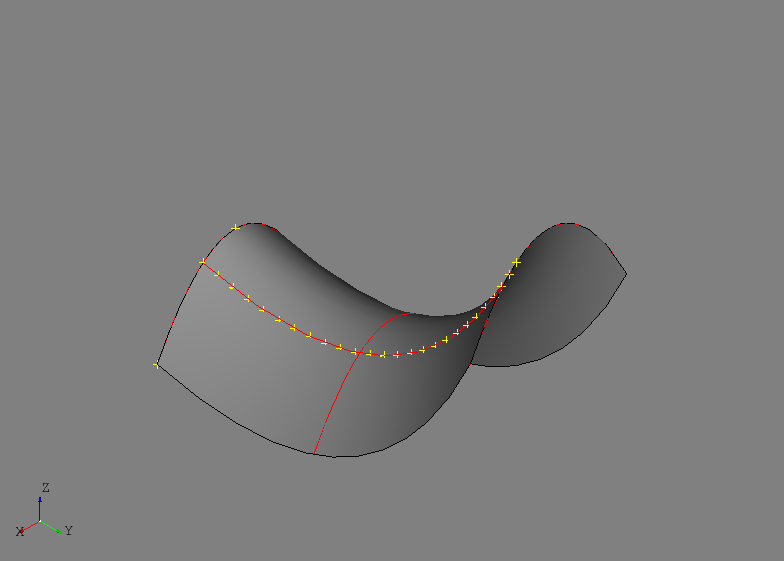

Geometry
========
The ``afem.geometry`` package provides entities and tools for the creation and
use of what is commonly referred to as "construction geometry" or "reference
geometry" for both 2-D and 3-D domains. This package primarily wraps a number
of OpenCASCADE native types and tools in order to provide a more "Pythonic"
user interface. The entities and tools in the ``geometry`` package do not cover
every OpenCASCADE type, but rather those frequently encountered during regular
use. The entities and tools can be imported by::

    from afem.geometry import *

Geometry entities cover general types like points, curves, planes, and
surfaces. Tools exists for the creation, modification, intersection, and
projection of the geometric entities. The simple example below demonstrates
some of the key entities and tools of the ``geometry`` package:

.. code-block:: python

    from afem.geometry import *
    from afem.graphics import Viewer

    gui = Viewer()

    # Create a point directly from the entity. Default is (0, 0, 0).
    p1 = Point()

    # Create a point by array-like
    p2 = PointByArray([5, 0, 5]).point

    # Create a point by x-, y-, and z-coordinates.
    p3 = PointByXYZ(10, 0, 0).point

    # Interpolate the points with a curve
    c1 = NurbsCurveByInterp([p1, p2, p3]).curve

    gui.add(p1, p2, p3, c1)
    gui.start()

    # Copy curve and translate
    c2 = c1.copy()
    c2.translate((0, 10, 0))

    gui.add(c2)
    gui.start()

    # Copy and translate again
    c3 = c2.copy()
    c3.translate((0, 10, 10))

    gui.add(c3)
    gui.start()

    # Approximate a surface
    s1 = NurbsSurfaceByApprox([c1, c2, c3]).surface

    gui.add(s1)
    gui.start()

    # Extract an iso-curve
    c4 = s1.u_iso(10.)

    gui.add(c4)
    gui.start()

    # Create points along the curve
    pnts = PointsAlongCurveByDistance(c4, 1.).points

    gui.add(*pnts)
    gui.start()

    # Extract iso-curve
    c5 = s1.v_iso(0.5)

    gui.add(c5)
    gui.start()

    # Intersect two curves
    cci = IntersectCurveCurve(c4, c5)

    gui.clear()
    gui.add(c4, c5, s1, *cci.points)
    gui.start()

    # Define a plane along a curve
    pln = PlaneFromParameter(c4, 0., 2.).plane

    # Intersect a surface and a plane
    ssi = IntersectSurfaceSurface(s1, pln)

    gui.add(s1, *ssi.curves)
    gui.start()

    # Project a point to a surface
    p4 = pln.eval(5, 5)
    proj = ProjectPointToSurface(p4, s1)
    line = NurbsCurveByInterp([p4, proj.nearest_point]).curve

    gui.add(p4, proj.nearest_point, line)
    gui.start()

The entities, tool, and viewing tool are imported by:

.. code-block:: python

    from afem.geometry import *
    from afem.graphics import Viewer

The first variable created is a ``Point`` and is constructed directly from the
entity itself. Since the ``Point`` class is derived from the OpenCASCADE type
``OCCT.gp.gp_Pnt``, one of the available constructor methods is using three
floats to define an x-, y-, and z-coordinate. By default the location is
(0., 0., 0.)::

    p1 = Point()

Points can also be created using a variety of tools including by an array or
specified x-, y-, and z-coordinates. When tools are used the underlying entity
must be retrieved from the tool by::

    p2 = PointByArray([5, 0, 5]).point
    p3 = PointByXYZ(10, 0, 0).point

A cubic curve can be created by interpolating points by::

    c1 = NurbsCurveByInterp([p1, p2, p3]).curve

Most geometry types can be copied and a limited number of transformations can
be directly applied to the entity depending on its type::

    c2 = c1.copy()
    c2.translate((0, 10, 0))

Here, a new ``NurbsCurve`` was created and then translated in the y-direction
by 10 units. This new curve is then copied again and translated in both the
y- and z-directions by 10 units each::

    c3 = c2.copy()
    c3.translate((0, 10, 10))

These three curves are then used to approximate a ``NurbsSurface``::

    s1 = NurbsSurfaceByApprox([c1, c2, c3]).surface

Isoparametric curves (i.e., isocurve) can be extracted from surfaces in both
the u- and v-directions. Below, an isocurve is extract at a constant u=10::

    c4 = s1.u_iso(10.)

This isocurve is used to generate evenly spaced points using a target distance
of 1 unit::

    pnts = PointsAlongCurveByDistance(c4, 1.).points

The ``PointsAlongCurveByDistance`` tool can also return the number of points
created, the parameters on the curve for each point, the final spacing, and the
interior points (i.e., exclude first and last). Others tools exist for creating
points (and planes) along curves by a specified number rather than distance.

At this point the created geometry should look similar to the image below.

Another isocurve in the opposite direction is created and the intersection is
found by::

    c5 = s1.v_iso(0.5)
    cci = IntersectCurveCurve(c4, c5)

The ``IntersectCurveCurve`` tool provides intersection results including the
point(s), parameter(s) on each curve, and number of intersections. Other tools
exist for curve/surface and surface/surface intersections. Intersecting a plane
and a surface is shown by::

    pln = PlaneFromParameter(c4, 0., 2.).plane
    ssi = IntersectSurfaceSurface(s1, pln)

A ``Plane`` is first created using the ``PlaneFromParameter`` tool and then
used in the ``IntersectSurfaceSurface`` tool. The resulting intersection curves
are approximated in 3-D space.

Projections to curves and surfaces are available using the projection tools. By
default, projections are usually performed normal to the curve or surface, but
some tools always projections along a specified direction. This operation
actually becomes a curve intersection operation rather than a normal
projection. The code below creates a point on a plane and then performs a
normal projection to the surface::

    p4 = pln.eval(5, 5)
    proj = ProjectPointToSurface(p4, s1)
    line = NurbsCurveByInterp([p4, proj.nearest_point]).curve

The ``line`` variable is created mostly for visualization purposes and to
demonstrate some of the data that can be retrieved from the
``ProjectPointToSurface`` tool. All point projection results are stored in the
tool and sorted by minimum to maximum distance.

The intersection and projection results should look similar to the image below.
Note that there are no renderings for infinite planes.

.. image:: ./resources/geometry_basic2.png

Entities
--------
.. py:currentmodule:: afem.geometry.entities

Geometry2D
~~~~~~~~~~
.. autoclass:: Geometry2D

Point2D
~~~~~~~
.. autoclass:: Point2D

Direction2D
~~~~~~~~~~~
.. autoclass:: Direction2D

Vector2D
~~~~~~~~
.. autoclass:: Vector2D

Curve2D
~~~~~~~
.. autoclass:: Curve2D

NurbsCurve2D
~~~~~~~~~~~~
.. autoclass:: NurbsCurve2D

Geometry
~~~~~~~~
.. autoclass:: Geometry

Point
~~~~~
.. autoclass:: Point

Direction
~~~~~~~~~
.. autoclass:: Direction

Vector
~~~~~~
.. autoclass:: Vector

Axis1
~~~~~
.. autoclass:: Axis1

Axis3
~~~~~
.. autoclass:: Axis3

Curve
~~~~~
.. autoclass:: Curve

Line
~~~~
.. autoclass:: Line

Circle
~~~~~~
.. autoclass:: Circle

Ellipse
~~~~~~~
.. autoclass:: Ellipse

NurbsCurve
~~~~~~~~~~
.. autoclass:: NurbsCurve

TrimmedCurve
~~~~~~~~~~~~
.. autoclass:: TrimmedCurve

Surface
~~~~~~~
.. autoclass:: Surface

Plane
~~~~~
.. autoclass:: Plane

NurbsSurface
~~~~~~~~~~~~
.. autoclass:: NurbsSurface

Create
------
.. py:currentmodule:: afem.geometry.create

PointByXYZ
~~~~~~~~~~
.. autoclass:: PointByXYZ

PointByArray
~~~~~~~~~~~~
.. autoclass:: PointByArray

PointFromParameter
~~~~~~~~~~~~~~~~~~
.. autoclass:: PointFromParameter

PointsAlongCurveByNumber
~~~~~~~~~~~~~~~~~~~~~~~~
.. autoclass:: PointsAlongCurveByNumber

PointsAlongCurveByDistance
~~~~~~~~~~~~~~~~~~~~~~~~~~
.. autoclass:: PointsAlongCurveByDistance

DirectionByXYZ
~~~~~~~~~~~~~~
.. autoclass:: DirectionByXYZ

DirectionByArray
~~~~~~~~~~~~~~~~
.. autoclass:: DirectionByArray

DirectionByPoints
~~~~~~~~~~~~~~~~~
.. autoclass:: DirectionByPoints

VectorByXYZ
~~~~~~~~~~~
.. autoclass:: VectorByXYZ

VectorByArray
~~~~~~~~~~~~~
.. autoclass:: VectorByArray

VectorByPoints
~~~~~~~~~~~~~~
.. autoclass:: VectorByPoints

LineByVector
~~~~~~~~~~~~
.. autoclass:: LineByVector

LineByPoints
~~~~~~~~~~~~
.. autoclass:: LineByPoints

CircleByNormal
~~~~~~~~~~~~~~
.. autoclass:: CircleByNormal

CircleByPlane
~~~~~~~~~~~~~
.. autoclass:: CircleByPlane

CircleBy3Points
~~~~~~~~~~~~~~~
.. autoclass:: CircleBy3Points

NurbsCurve2DByInterp
~~~~~~~~~~~~~~~~~~~~
.. autoclass:: NurbsCurve2DByInterp

NurbsCurve2DByApprox
~~~~~~~~~~~~~~~~~~~~
.. autoclass:: NurbsCurve2DByApprox

NurbsCurve2DByPoints
~~~~~~~~~~~~~~~~~~~~
.. autoclass:: NurbsCurve2DByPoints

NurbsCurveByInterp
~~~~~~~~~~~~~~~~~~
.. autoclass:: NurbsCurveByInterp

NurbsCurveByApprox
~~~~~~~~~~~~~~~~~~
.. autoclass:: NurbsCurveByApprox

NurbsCurveByPoints
~~~~~~~~~~~~~~~~~~
.. autoclass:: NurbsCurveByPoints

TrimmedCurveByPoints
~~~~~~~~~~~~~~~~~~~~
.. autoclass:: TrimmedCurveByPoints

PlaneByNormal
~~~~~~~~~~~~~
.. autoclass:: PlaneByNormal

PlaneByAxes
~~~~~~~~~~~
.. autoclass:: PlaneByAxes

PlaneByPoints
~~~~~~~~~~~~~
.. autoclass:: PlaneByPoints

PlaneByApprox
~~~~~~~~~~~~~
.. autoclass:: PlaneByApprox

PlaneFromParameter
~~~~~~~~~~~~~~~~~~
.. autoclass:: PlaneFromParameter

PlaneByOrientation
~~~~~~~~~~~~~~~~~~
.. autoclass:: PlaneByOrientation

PlaneByCurveAndSurface
~~~~~~~~~~~~~~~~~~~~~~
.. autoclass:: PlaneByCurveAndSurface

PlanesAlongCurveByNumber
~~~~~~~~~~~~~~~~~~~~~~~~
.. autoclass:: PlanesAlongCurveByNumber

PlanesAlongCurveByDistance
~~~~~~~~~~~~~~~~~~~~~~~~~~
.. autoclass:: PlanesAlongCurveByDistance

PlanesBetweenPlanesByNumber
~~~~~~~~~~~~~~~~~~~~~~~~~~~
.. autoclass:: PlanesBetweenPlanesByNumber

PlanesBetweenPlanesByDistance
~~~~~~~~~~~~~~~~~~~~~~~~~~~~~
.. autoclass:: PlanesBetweenPlanesByDistance

PlanesAlongCurveAndSurfaceByDistance
~~~~~~~~~~~~~~~~~~~~~~~~~~~~~~~~~~~~
.. autoclass:: PlanesAlongCurveAndSurfaceByDistance

NurbsSurfaceByInterp
~~~~~~~~~~~~~~~~~~~~
.. autoclass:: NurbsSurfaceByInterp

NurbsSurfaceByApprox
~~~~~~~~~~~~~~~~~~~~
.. autoclass:: NurbsSurfaceByApprox

Project
-------
.. py:currentmodule:: afem.geometry.project

PointProjector
~~~~~~~~~~~~~~
.. autoclass:: PointProjector

ProjectPointToCurve
~~~~~~~~~~~~~~~~~~~
.. autoclass:: ProjectPointToCurve

ProjectPointToSurface
~~~~~~~~~~~~~~~~~~~~~
.. autoclass:: ProjectPointToSurface

CurveProjector
~~~~~~~~~~~~~~
.. autoclass:: CurveProjector

ProjectCurveToPlane
~~~~~~~~~~~~~~~~~~~
.. autoclass:: ProjectCurveToPlane

ProjectCurveToSurface
~~~~~~~~~~~~~~~~~~~~~
.. autoclass:: ProjectCurveToSurface

Intersect
---------
.. py:currentmodule:: afem.geometry.intersect

CurveIntersector
~~~~~~~~~~~~~~~~
.. autoclass:: CurveIntersector

IntersectCurveCurve
~~~~~~~~~~~~~~~~~~~
.. autoclass:: IntersectCurveCurve

IntersectCurveSurface
~~~~~~~~~~~~~~~~~~~~~
.. autoclass:: IntersectCurveSurface

SurfaceIntersector
~~~~~~~~~~~~~~~~~~
.. autoclass:: SurfaceIntersector

IntersectSurfaceSurface
~~~~~~~~~~~~~~~~~~~~~~~
.. autoclass:: IntersectSurfaceSurface

Distance
--------
.. py:currentmodule:: afem.geometry.distance

DistancePointToCurve
~~~~~~~~~~~~~~~~~~~~
.. autoclass:: DistancePointToCurve

DistancePointToSurface
~~~~~~~~~~~~~~~~~~~~~~
.. autoclass:: DistancePointToSurface

DistanceCurveToCurve
~~~~~~~~~~~~~~~~~~~~
.. autoclass:: DistanceCurveToCurve

DistanceCurveToSurface
~~~~~~~~~~~~~~~~~~~~~~
.. autoclass:: DistanceCurveToSurface

DistanceSurfaceToSurface
~~~~~~~~~~~~~~~~~~~~~~~~
.. autoclass:: DistanceSurfaceToSurface

Check
-----

CheckGeom
~~~~~~~~~
.. py:currentmodule:: afem.geometry.check
.. autoclass:: CheckGeom

Utilities
---------
.. automodule:: afem.geometry.utils