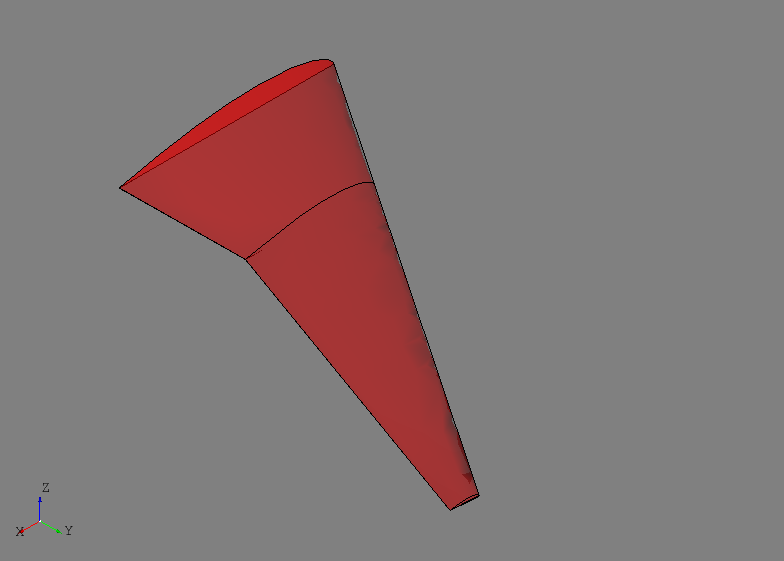
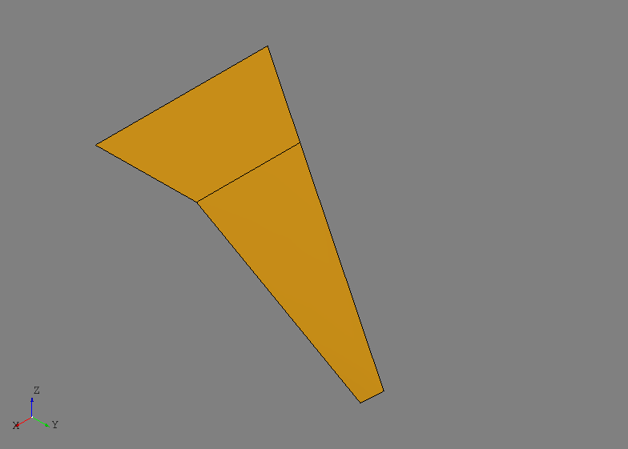
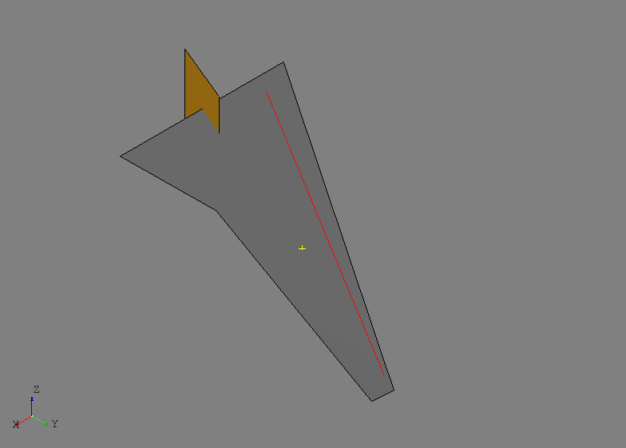

OML
===
The ``oml`` package provides a minimal set of entities and tools intended to
make defining structural components easier and more efficient. Many of the
tools used to create parts require a solid defining the common material of
the part given its basis shape. Some tools are more automated and parametric
and therefore need more information, like a reference surface or curve. The
``oml`` package, and more specifically the ``Body`` class, are intended to
provide a single type that contains all necessary information. The entities
and tools can be imported by::

    from afem.oml import *

The intent of the ``oml`` package and the ``Body`` class is best understood by
manually building a solid shape that represents a basic wing as shown in the
following example:

.. code-block:: python

    from math import tan, radians

    from afem.geometry import *
    from afem.graphics import Viewer
    from afem.oml import *
    from afem.sketch import *
    from afem.topology import *

    # Parameters
    semispan = 107.  # wing semi-span
    sweep = 34.  # Leading edge sweep
    uk = 0.28  # Percent semi-span to locate section cross section
    c1 = 51.5  # Root chord
    c2 = 31.  # Chord of second section
    c3 = 7.  # Tip chord
    t3 = 3.  # Tip washout in degrees

    # Define leading edge points of cross sections
    p1x, p1y = 0., 0.
    p2x = semispan * uk * tan(radians(sweep))
    p2y = semispan * uk
    p3x = semispan * tan(radians(sweep))
    p3y = semispan

    # Create a cross section using an UIUC airfoil file
    cs = Airfoil()
    cs.read_uiuc('../models/clarky.dat')

    # Define cross section planes
    pln1 = PlaneByAxes((p1x, p1y, 0), axes='xz').plane
    pln2 = PlaneByAxes((p2x, p2y, 0), axes='xz').plane
    pln3 = PlaneByAxes((p3x, p3y, 0), axes='xz').plane

    # Build cross sections
    cs.build(pln1, scale=c1)
    wire1 = cs.wires[0]
    cs.build(pln2, scale=c2)
    wire2 = cs.wires[0]
    cs.build(pln3, scale=c3, rotate=t3)
    wire3 = cs.wires[0]

    # Loft a solid
    shape = LoftShape([wire1, wire2, wire3], True, make_ruled=True).shape

    # Make a body
    wing = Body(shape, 'Wing')
    wing.set_transparency(0.5)
    wing.set_color(1, 0, 0)

    # Build a reference surface using chord lines of the cross sections. Make sure
    # to use the same scaling and rotation parameters. Set the parametric domains
    # to be between 0 and 1 for convenience.
    chord1 = cs.build_chord(pln1, scale=c1)
    chord2 = cs.build_chord(pln2, scale=c2)
    chord3 = cs.build_chord(pln3, scale=c3, rotate=t3)
    sref = NurbsSurfaceByInterp([chord1, chord2, chord3], 1).surface
    sref.set_udomain(0., 1.)
    sref.set_vdomain(0., 1.)

    # Set the wing reference surface
    wing.set_sref(sref)

    # Show wing and reference surface
    gui = Viewer()
    gui.add(wing, wing.sref)
    gui.start()

    # Show the underlying shape of the reference surface
    gui.clear()
    gui.add(wing.sref_shape)
    gui.start()

    # Evaluate point
    p = wing.eval(0.5, 0.5)

    # Extract a plane
    pln = wing.extract_plane(0.5, 0., 0.5, 0.5)
    face = FaceByPlane(pln, -10, 10, -10, 10).face

    # Extract a trimmed curve
    crv = wing.extract_curve(0.15, 0.05, 0.15, 0.95)

    gui.clear()
    gui.add(wing.sref, p, face, crv)
    gui.start()

After the necessary modules are imported, a few parameters are specified that
will be used to define the shape of the wing:

.. code-block:: python

    semispan = 107.  # wing semi-span
    sweep = 34.  # Leading edge sweep
    uk = 0.28  # Percent semi-span to locate section cross section
    c1 = 51.5  # Root chord
    c2 = 31.  # Chord of second section
    c3 = 7.  # Tip chord
    t3 = 3.  # Tip washout in degrees

The wing will be defined by three cross sections using the same airfoil but
at different locations and scales. A constant leading edge sweep is assumed so
the leading edge locations of each cross section are:

.. code-block:: python

    p1x, p1y = 0., 0.
    p2x = semispan * uk * tan(radians(sweep))
    p2y = semispan * uk
    p3x = semispan * tan(radians(sweep))
    p3y = semispan

An airfoil from the UIUC airfoil database is used to create the cross section:

.. code-block:: python

    cs = Airfoil()
    cs.read_uiuc('../models/clarky.dat')

One advantage of using an ``Airfoil`` is that the leading and trailing edge
points are stored and from that a chord line can be built which later will be
used to build additional reference geometry stored with the wing.

Three planes are defined using the points derived from the wing parameters:

.. code-block:: python

    pln1 = PlaneByAxes((p1x, p1y, 0), axes='xz').plane
    pln2 = PlaneByAxes((p2x, p2y, 0), axes='xz').plane
    pln3 = PlaneByAxes((p3x, p3y, 0), axes='xz').plane

These planes represent the eventual location of the 3-D airfoil cross sections
where the local origin of the plane is also the leading edge in this case. At
each section, a 3-D wire is built by providing the 3-D plane and a scaling and
rotation parameter:

.. code-block:: python

    cs.build(pln1, scale=c1)
    wire1 = cs.wires[0]
    cs.build(pln2, scale=c2)
    wire2 = cs.wires[0]
    cs.build(pln3, scale=c3, rotate=t3)
    wire3 = cs.wires[0]

These wires are then used to loft a solid shape::

    shape = LoftShape([wire1, wire2, wire3], True, make_ruled=True).shape

The ``make_ruled=True`` option was used to produce linear segments between the
airfoil cross sections, rather than blending them together with approximation.

At this point, a solid body (i.e., a ``TopoDS_Solid``) has been defined and a
``Body`` can be initialized::

    wing = Body(shape, 'Wing')

The ``label`` parameter, given as "Wing" in this example, is optional but is
useful and can be treated as a default type of metadata. Defining a valid
``TopoDS_Solid`` is the only hard requirement when defining a ``Body`` for use
during structural modeling. The user can use all the tools available to create
them manually as done above, or they can be derived by importing data from
other sources such as STEP files. The wing derived above is shown below:

It is at times convenient to define structural components using normalized or
relative parameters rather than in absolute terms. For example, in a wing it is
common to define a spar's location and orientation by percent chord and percent
semispan. This leads to the need for some kind of "reference geometry" on which
to evaluate these types of parameters. For a wing, a natural solution is to
define a continuous surface that generally represents its planform shape. Since
many of the structural modeling tools use this type of surface, storing a
"reference surface" and other reference geometry is provided by the ``Body``
class.

For the wing shown above, a reference surface will be built by lofting the
chord lines of the three airfoil cross sections:

.. code-block:: python

    chord1 = cs.build_chord(pln1, scale=c1)
    chord2 = cs.build_chord(pln2, scale=c2)
    chord3 = cs.build_chord(pln3, scale=c3, rotate=t3)
    sref = NurbsSurfaceByInterp([chord1, chord2, chord3], 1).surface
    sref.set_udomain(0., 1.)
    sref.set_vdomain(0., 1.)

The chord lines are built using the same scaling and rotation parameters and a
linear surface is constructed. The parametric domain of the surface is set to
be between 0 and 1 for convenience. This essentially corresponds to the
u-direction being percent chord and the v-direction percent semispan (in this
case along the sweep direction). The surface is set as the reference surface
by::

    wing.set_sref(sref)

When a reference surface is set, the method will automatically construct an
underlying shape by splitting the surface at any C1 discontinuities. This shape
is primarily used for intersection methods when extracting curves since C1
discontinuous surfaces may be numerically unreliable, but it is provided to the
user if needed. This ``wing.sref_shape`` is shown below:

A number of methods are provided for convenience if the Body contains reference
geometry such as as reference surface. A point on the surface can be evaluated
by::

    p = wing.eval(0.5, 0.5)

A plane can be defined between two points using the reference surface::

    pln = wing.extract_plane(0.5, 0., 0.5, 0.5)

Here, two points are defined and then a third is defined by translating the
first point in the direction of the reference surface normal. These three
points are used to define a plane which can be useful for structural modeling.

Sometimes it may be useful to build a curve within the reference surface
between two points as shown below::

    crv = wing.extract_curve(0.15, 0.05, 0.15, 0.95)

This method will generated a ``TrimmedCurve`` between the parameters by
intersecting a ``basis_shape`` with the reference surface. If a basis shape is
not provided, a plane will be constructed as described above. The result of
these methods are shown below:

The main takeaway for the ``oml`` package and the ``Body`` class is that it is
meant to be a container for minimum data needed for structural modeling with
minimal restrictions and assumptions. Creating the solid contained by the Body,
as well as any associated reference geometry, can be as complex or as simple as
the user needs and/or desires.

Entities
--------
.. py:currentmodule:: afem.oml.entities

Body
~~~~
.. autoclass:: Body

Check
-----

CheckOML
~~~~~~~~
.. autoclass:: afem.oml.check.CheckOML