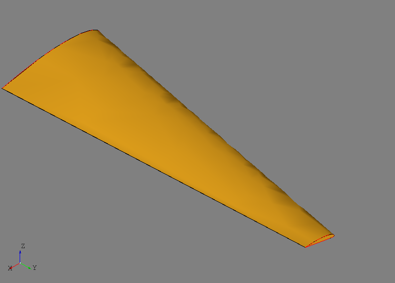

Sketch
======
The ``afem.sketch`` package provides basic entities and tools for the creation
of 2-D planar geometry. This is not a constraint-solving sketch module
like ones found in most CAD systems, but rather a simplified way to define
planar 2-D curves and convert them to 3-D for operations like lofting or
extrusion. The entities and tools can be imported by::

    from afem.sketch import *

The general process to use the ``sketch`` package is to define a reference
plane in 3-D space, use that plane to define 2-D geometry, and then convert
that 2-D geometry into 3-D space. The example below demonstrates this process:

.. code-block:: python

    from afem.geometry import *
    from afem.graphics import Viewer
    from afem.sketch import *
    from afem.topology import *

    # Create a new cross section
    cs = Airfoil()

    # Generate a 2-D profile by reading and approximating an airfoil file from
    # the UIUC database. Close the trailing edge if necessary.
    cs.read_uiuc('../models/clarky.dat', close=True)

    # Define a plane at the root and scale
    pln1 = PlaneByAxes(axes='xz').plane
    cs.build(pln1, scale=5)
    wire1 = cs.wires[0]

    # Define plane at the tip and rotate
    pln2 = PlaneByAxes((3, 15, 0), axes='xz').plane
    cs.build(pln2, scale=1.5, rotate=3)
    wire2 = cs.wires[0]

    # Use the wires to loft a solid
    shape = LoftShape([wire1, wire2], True).shape

    gui = Viewer()
    gui.add(wire1, wire2, shape)
    gui.start()

The ``sketch`` entities and tools are imported by:

.. code-block:: python

    from afem.geometry import *
    from afem.graphics import Viewer
    from afem.sketch import *
    from afem.topology import *

A special type of ``CrossSection`` will be used to generate a section from an
airfoil file::

    cs = Airfoil()

where ``cs`` uses the xy-plane by default since no plane was provided. This
default reference plane is the one used when defining 2-D geometry. The plane's
origin corresponds to the (0, 0) location of the local coordinate system.

In this example, a 2-D curve is generated by reading an airfoil file from the
UIUC_ database::

    cs.read_uiuc('../models/clarky.dat', close=True)

The option ``close=True`` is used to close the trailing edge of the airfoil if
it is open (i.e., the points are not coincident). This methods uses 2-D
approximation to fit the airfoil points.

The 2-D profile can now be converted to 3-D space by providing a new 3-D plane
in the ``build`` method:

.. code-block:: python

    pln1 = PlaneByAxes(axes='xz').plane
    cs.build(pln1, scale=5)
    wire1 = cs.wires[0]

Note that the new plane can be oriented in any way, but the 2-D geometry will
be relative to the plane's origin and local axes. The ``build`` method accepts
a global scaling and rotation parameter which is relative to the plane's
origin. When the cross section is built, 3-D topology will be available
for use. Another section is built using a different reference plane as well as
different scaling and rotation parameters:

.. code-block:: python

    pln2 = PlaneByAxes((3, 15, 0), axes='xz').plane
    cs.build(pln2, scale=1.5, rotate=3)
    wire2 = cs.wires[0]

Note that the same 2-D profile is used to generate different 3-D shapes. The
two wires created by this process are closed and used to generate a lofted
solid::

    shape = LoftShape([wire1, wire2], True).shape

The results can be visualized using the viewing tool and should look like the
wing shape shown below:

.. code-block:: python

    gui = Viewer()
    gui.add(wire1, wire2, shape)
    gui.start()

.. _UIUC: http://m-selig.ae.illinois.edu/ads/coord_database.html

Entities
--------
.. py:currentmodule:: afem.sketch.entities

CrossSection
~~~~~~~~~~~~
.. autoclass:: CrossSection

Airfoil
~~~~~~~
.. autoclass:: Airfoil

