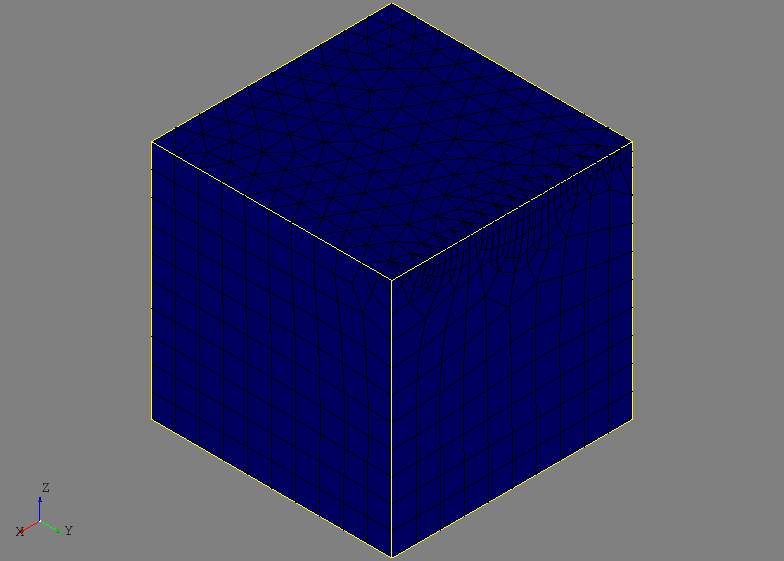
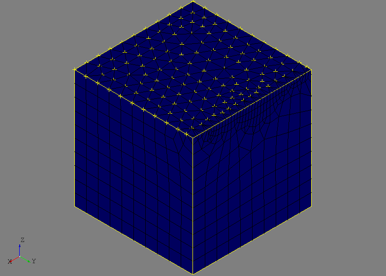

SMESH
=====
The ``afem.smesh`` packages provides entities and tools for working with the
meshing library which is a standalone version from the Salome Platform. Similar
to the OpenCASCADE C++ library, the SMESH library is linked to OpenCASCADE and
exposed to Python via pybind11. To provide a more intuitive and "Pythonic" user
interface, the ``smesh`` package within AFEM provides a number of wrappers
around the core SMESH entities. This approach is similar to the ``geometry``
package. The entities and tools can be imported by::

    from afem.smesh import *

There are a few key concepts and entities that need to be understood by the
user in order use the meshing package effectively. These are best discussed by
working through a simple but complete example:

.. code-block:: python

    from afem.graphics import Viewer
    from afem.smesh import (MeshGen, NetgenAlgo2D, NetgenSimple2D, MaxLength1D,
                            Regular1D)
    from afem.topology import *

    # Create a simple solid box
    box = BoxBySize(10, 10, 10).solid

    # Get a list of faces and edges of the shape for later use
    faces = box.faces
    edges = box.edges

    # Initialize the mesh generator
    gen = MeshGen()

    # Create a new mesh using the box as the shape
    mesh = gen.create_mesh(box)

    # Define algorithms and hypotheses
    alg2d = NetgenAlgo2D(gen)
    hyp2d_1 = NetgenSimple2D(gen, 1.)
    hyp2d_2 = NetgenSimple2D(gen, 1., allow_quads=False)
    alg1d = Regular1D(gen)
    hyp1d = MaxLength1D(gen, 0.25)

    # Add them to the mesh
    mesh.add_hypotheses([alg2d, hyp2d_1])
    mesh.add_hypothesis(hyp2d_2, faces[-1])
    mesh.add_hypotheses([alg1d, hyp1d], edges[-1])

    # Compute the mesh
    gen.compute(mesh)

    # View the mesh
    gui = Viewer()
    gui.add(mesh)
    gui.start()
    gui.clear()

    # Get sub-meshes from sub-shapes
    face_submesh = mesh.get_submesh(faces[0])
    edge_submesh = mesh.get_submesh(edges[0])

    # View the face sub-mesh (2-D elements)
    gui.add(face_submesh)
    gui.start()
    gui.clear()

    # View the edge sub-mesh (1-D elements)
    gui.add(edge_submesh)
    gui.start()

This example creates a simple solid box and then generates a 2-D mesh on its
faces. Like any other Python script or module, the required entities must be
imported:

.. code-block:: python

    from afem.graphics import Viewer
    from afem.smesh import (MeshGen, NetgenAlgo2D, NetgenSimple2D, MaxLength1D,
                            Regular1D)
    from afem.topology import *

The :class:`.BoxBySize` tool is used to create a simple solid box::

    bbox = BoxBySize(10, 10, 10).solid

Providing three numbers creates a box with one corner at (0, 0, 0) and the
other at x=10, y=10, and z=10.

When it is time to begin the meshing process, it is required to first
initialize the core mesh generator and data structure :class:`.MeshGen`. This
entity is responsible for managing the entire meshing data structure and
typically only one should be created. Generating more than one instance might
be used if two entirely different meshes need to be created in a single
process. Create an instance by::

    gen = MeshGen()

The reference to this variable (``gen`` is this example) should not be
destroyed until the meshing process is complete. When the reference count drops
to zero, the entire meshing data structure will be destroyed and the memory
freed.

A new mesh entity is created by::

    mesh = gen.create_mesh(box)

The ``box`` variable is provided to this method so that is sets the box as the
"shape to mesh." Selecting the shape to mesh is an important step as this main
shape will be used to derive and access information if sub-meshes or local
meshing controls are applied later in the process. In practice, the main shape
to mesh will typically be a single :class:`.Compound` that contains all the
shapes of the current model. An error will result if a sub-mesh or local mesh
control is applied to a sub-shape that is not a member of the original main
shape.

The next step in the meshing process is usually to define algorithms and
hypotheses that will control mesh types and parameters like edge length and
gradation. Usually, it is required to apply both an algorithm and hypothesis
to a shape. The algorithm controls execution within the meshing process while a
hypothesis controls the meshing parameters. In the example, a 2-D algorithm and
hypothesis is created for the Netgen mesh generator that will generate 2-D
elements on the faces of the shape:

.. code-block:: python

    alg2d = NetgenAlgo2D(gen)
    hyp2d_1 = NetgenSimple2D(gen, 1.)
    hyp2d_2 = NetgenSimple2D(gen, 1., allow_quads=False)

The ``hyp2d_1`` will be the default global hypothesis and ``hyp2d_2`` is
created to generate a triangular mesh. At the same time, a 1-D algorithm and
hypothesis is created that will be used to control the mesh on specific edges:

.. code-block:: python

    alg1d = Regular1D(gen)
    hyp1d = MaxLength1D(gen, 0.25)

These algorithms and hypotheses can be added to the mesh and sub-shapes if
applicable. First, the global algorithm and hypothesis is applied::

    mesh.add_hypotheses([alg2d, hyp2d_1])

Here, no shape is provided so this algorithm and hypothesis is applied to the
main shape and all applicable sub-shapes. If more local control is desired,
algorithms and hypotheses must be added along with their associated
sub-shape(s)::

    mesh.add_hypothesis(hyp2d_2, faces[-1])

The second hypothesis using triangles is added to one of the faces of the main
shape. Only the new hypothesis was applied since the same algorithm can be
used. Controlling the mesh along a specific edge can be done by::

    mesh.add_hypotheses([alg1d, hyp1d], edges[-1])

It should be noted that the provided shape (or sub-shape) can be a single shape
like an edge, face, or solid, but it could also be a compound of multiple
shapes or sub-shapes. That is, edges could be put into a :class:`.Compound` and
the 1-D controls would be applied to all edges in that compound.

With the shape set and meshing controls applied, the mesh is computed by::

    gen.compute(mesh)

The next part of the script simply displays the mesh and sub-meshes
derived from sub-shapes of the main shape. These sub-meshes can be used to
access nodes and elements.

Towards the end of the script a small demonstration of the :class:`.MeshGroup`
class is provided:

.. code-block:: python

    # Use groups to organize mesh data
    edge_nodes = mesh.create_group('edge nodes', mesh.NODE, edges[-1])
    face_nodes = mesh.create_group('face nodes', mesh.NODE, faces[-1])

Mesh groups are an excellent mechanism for organizing and accessing mesh data.
The code above creates two groups of nodes on an edge and a face of the box.
Other types of groups can be created for 1-D edge elements, as well as 2-D face
elements including triangles and quadrangles. These groups make accessing the
mesh data from the given shape much easier, flexible, and robust then using
sub-meshes (this is not the intended purpose of sub-meshes anyway). Mesh groups
can actually be created before the mesh is computed.

For mesh groups of similar type, additional organizational methods are provided
including union, intersect, and subtracting the mesh data between two groups.
In the example below, the nodes from the edge group are subtracted from the
nodes in the face group::

    group = face_nodes.subtract(edge_nodes)

A new group is created (without association to any shape) and is shown below.
The same operations will be available for any two groups of similar type.

Entities
--------
.. py:currentmodule:: afem.smesh.entities

Node
~~~~
.. autoclass:: Node

Element
~~~~~~~
.. autoclass:: Element

FaceSide
~~~~~~~~~
.. autoclass:: FaceSide

MeshGen
~~~~~~~
.. autoclass:: MeshGen

Mesh
~~~~
.. autoclass:: Mesh

MeshDS
~~~~~~
.. autoclass:: MeshDS

SubMesh
~~~~~~~
.. autoclass:: SubMesh

SubMeshDS
~~~~~~~~~
.. autoclass:: SubMeshDS

MeshGroup
~~~~~~~~~
.. autoclass:: MeshGroup

Hypotheses
----------
.. py:currentmodule:: afem.smesh.hypotheses

Hypothesis
~~~~~~~~~~
.. autoclass:: Hypothesis

Algorithm
~~~~~~~~~
.. autoclass:: Algorithm

Regular1D
~~~~~~~~~
.. autoclass:: Regular1D

CompositeSide1D
~~~~~~~~~~~~~~~
.. autoclass:: CompositeSide1D

MaxLength1D
~~~~~~~~~~~
.. autoclass:: MaxLength1D

LocalLength1D
~~~~~~~~~~~~~
.. autoclass:: LocalLength1D

NumberOfSegments1D
~~~~~~~~~~~~~~~~~~
.. autoclass:: NumberOfSegments1D

Adaptive1D
~~~~~~~~~~
.. autoclass:: Adaptive1D

Deflection1D
~~~~~~~~~~~~
.. autoclass:: Deflection1D

QuadrangleAlgo2D
~~~~~~~~~~~~~~~~
.. autoclass:: QuadrangleAlgo2D

QuadrangleHypo2D
~~~~~~~~~~~~~~~~
.. autoclass:: QuadrangleHypo2D

NetgenHypothesis
~~~~~~~~~~~~~~~~
.. autoclass:: NetgenHypothesis

NetgenAlgo2D
~~~~~~~~~~~~
.. autoclass:: NetgenAlgo2D

NetgenAlgoOnly2D
~~~~~~~~~~~~~~~~
.. autoclass:: NetgenAlgoOnly2D

NetgenHypo2D
~~~~~~~~~~~~
.. autoclass:: NetgenHypo2D

NetgenSimple2D
~~~~~~~~~~~~~~
.. autoclass:: NetgenSimple2D

NetgenAlgo3D
~~~~~~~~~~~~
.. autoclass:: NetgenAlgo3D

NetgenAlgo2D3D
~~~~~~~~~~~~~~
.. autoclass:: NetgenAlgo2D3D

MeshGemsAlgo2D
~~~~~~~~~~~~~~
.. autoclass:: MeshGemsAlgo2D

MeshGemsHypo2D
~~~~~~~~~~~~~~
.. autoclass:: MeshGemsHypo2D

Utilities
---------
.. py:currentmodule:: afem.smesh.utils

MeshEditor
~~~~~~~~~~
.. autoclass:: MeshEditor

MeshHelper
~~~~~~~~~~
.. autoclass:: MeshHelper
