Structure
=========
The ``afem.structure`` package provides the low-level types and tools that the
user can leverage to build more complete and useful aircraft structural models.
This package is the main focus of the entire AFEM project and is built on top
of almost all the other packages. The entities and tools can be imported by::

    from afem.structure import *

The sub-sections and example below will describe the package in more detail,
but some discussion about the general modeling approach and "best-practices" is
helpful. The AFEM library does not necessarily provide new methods for building
structural geometry, but rather focuses on providing a more specialized API
and workflow that streamlines and automates many of the repetitive and
mundane tasks typically encountered in the traditional modeling process. The
end result is still B-Rep topology and a finite element model and therefore is
still subject to the limitations and/or weaknesses of these modeling
paradigms. This may include robustness of Boolean operations within the
geometric modeling kernel or the quality of the finite element mesh. Through
experience, a procedure has been found to work well for a wide range of
applications:

1. Build initial parts
    The first step of the process is simply defining the initial reference
    geometry and shape for the part without any real topological connection
    to any others. At this point, the parts and their shapes can be used to
    build others but there is less concern or emphasis for details like
    establishing topologically congruent edges. The goal for this initial step
    is to define the initial part shape as quickly and easily as possible while
    keeping its representation flexible.

2. Join parts
    The initial part shapes may be connected spatially but disconnected
    topologically. It's during this step that modeling tools are used to join
    the various shapes together to form shared and congruent edges between
    the connecting parts. Modeling flexibility is reduced after this step and
    joining operations are best done to large groups of connected parts so that
    joints with multiple and complex intersections can be handled robustly. If
    new parts are created after this step and joined locally with ones that
    already exist and have been joined, it is not guaranteed that the overall
    model will maintain the proper topology. In this case, it would be better
    to define the part in the first step and include in the overall joining
    operation. The structure usually involved in this step is the internal
    structure such as ribs, spars, bulkheads, frames, etc. The external skin
    is usually joined in a later step.

3. Trim parts
    After the parts have been joined, it is usually the case that certain
    pieces or regions of the parts should be discarded. For example, if
    modeling only the primary load-carrying structure of a wing box, the
    regions of the ribs aft of the rear spar may need to be removed from the
    model. In an interactive GUI, this would be a "select and delete" action.
    Typically, no new topology is introduced in this step but rather certain
    regions of the existing model are removed without modifying others. For the
    wing box example mentioned earlier, this may be first identifying the faces
    aft of the rear spar using various tools and then removing those faces from
    the shape. As mentioned earlier, Step 2 usually involves joining internal
    structure and not necessarily external structure like the wing skin.
    Joining the external skins with internal structure is is best done after
    the internal structure has been joined and trimmed. This avoids creating
    unnecessary edges in the shape of the external structure since internal
    regions will be discarded.

4. Applying meshing controls
    At this point, it is assumed the geometrical modeling operations are
    complete and now a finite element mesh can be created. Various tools are
    provided for applying both global and local meshing controls on any part,
    shape, or sub-shape. The number of elements along an edge or max element
    size on a face can be applied on a per edge or face level.

5. Generate FEM
    The last step is simply computing the FEM considering the global shape to
    mesh and all the local meshing controls (if any). The result is a mesh data
    structure that can be supplied to downstream processes. Local mesh data
    for a part, shape, or sub-shape can be extracted from this global mesh to
    further support downstream tools and processes.

The basic wing box example below goes through each of these steps in more
detail and highlights the key features, types, and tools in the AFEM toolkit:

.. code-block:: python

    from afem.config import Settings
    from afem.exchange import ImportVSP
    from afem.geometry import *
    from afem.graphics import Viewer
    from afem.structure import *
    from afem.topology import *

    Settings.log_to_console()

    # Set units to inch.
    Settings.set_units('in')

    # Initialize a viewer
    gui = Viewer()

    # Import an OpenVSP model that includes OML reference geometry
    fn = r'../models/simple_wing.stp'
    vsp_import = ImportVSP(fn)
    wing = vsp_import['WingGeom']
    wing.set_color(1., 0., 0.)
    wing.set_transparency(0.75)

    gui.add(wing.sref, wing)
    gui.start()
    gui.clear()

    # Define a group to put the structure in
    wingbox = GroupAPI.create_group('wing box')
    spars_assy = wingbox.create_subgroup('spar assy', active=True)
    ribs_assy = wingbox.create_subgroup('rib assy', active=False)

    # Define a front spar between parameters on the wing reference surface
    fspar = SparByParameters('fspar', 0.15, 0.1, 0.15, 0.98, wing).part

    gui.add(wing.sref, fspar, fspar.cref, fspar.cref.p1, fspar.cref.p2)
    gui.start()

    # Define a rear spar between parameters on the wing reference surface
    rspar = SparByParameters('rspar', 0.65, 0.1, 0.65, 0.98, wing).part

    gui.add(rspar, rspar.cref, rspar.cref.p1, rspar.cref.p2)
    gui.start()

    # Activate rib assembly
    ribs_assy.activate()

    # Define root rib between front and rear spar
    root = RibByPoints('root', fspar.cref.p1, rspar.cref.p1, wing).part

    gui.add(root, root.cref, root.cref.p1, root.cref.p2)
    gui.start()

    # Define tip rib between front and rear spar
    tip = RibByPoints('tip', fspar.cref.p2, rspar.cref.p2, wing).part

    gui.add(tip, tip.cref, tip.cref.p1, tip.cref.p2)
    gui.start()

    # Add ribs between root and tip perpendicular to rear spar reference curve
    ribs = RibsAlongCurveByDistance('rib', rspar.cref, 30., fspar, rspar, wing,
                                    d1=30., d2=-30.).parts

    for rib in ribs:
        gui.add(rib, rib.cref, rib.cref.p1, rib.cref.p2)
    gui.start()

    # Activate spar assembly
    spars_assy.activate()

    # Add a front center spar considering the intersection between the front
    # spar and the root rib. If this is not considered, the front center spar
    # may be oriented in such a way that causes it to have a gap with the front
    # spar and root rib.
    p1 = wing.sref.eval(0.25, .0)
    pln = PlaneByIntersectingShapes(fspar.shape, root.shape, p1).plane
    fcspar = SparByPoints('fcspar', p1, root.cref.p1, wing, pln).part

    gui.add(fcspar, fcspar.cref, fcspar.cref.p1, fcspar.cref.p2)
    gui.start()

    # Add rear center spar
    p1 = wing.sref.eval(0.75, .0)
    pln = PlaneByIntersectingShapes(rspar.shape, root.shape, p1).plane
    rcspar = SparByPoints('rcspar', p1, root.cref.p2, wing, pln).part

    gui.add(rcspar, rcspar.cref, rcspar.cref.p1, rcspar.cref.p2)
    gui.start()

    # Activate rib assembly
    ribs_assy.activate()

    # Add center ribs using a reference plane alonge the rear center spar
    ref_pln = PlaneByAxes(origin=(0., 0., 0.), axes='xz').plane
    ribs = RibsAlongCurveByNumber('center rib', rcspar.cref, 3, fcspar, rcspar,
                                  wing, ref_pln, d1=6, d2=-18).parts

    for rib in ribs:
        gui.add(rib, rib.cref, rib.cref.p1, rib.cref.p2)
    gui.start()

    # Draw the part reference curves to see what the layout will eventually
    # look like
    gui.clear()
    gui.add(wing.sref)
    for part in wingbox.get_parts():
        gui.add(part.cref)
    gui.start()

    # Join the internal structure using their reference curves to check for
    # actual intersection
    internal_parts = wingbox.get_parts()
    FuseSurfacePartsByCref(internal_parts)

    gui.add(wingbox)
    gui.start()

    # Discard faces of parts using the reference curve
    DiscardByCref(internal_parts)

    gui.clear()
    gui.add(wingbox)
    gui.start()

    # Activate wingbox assembly
    wingbox.activate()

    # Extract the shell of wing to define the wing skin
    skin = SkinByBody('skin', wing).part
    skin.set_transparency(0.5)

    gui.add(skin)
    gui.start()

    # Join the wing skin with the internal structure
    skin.fuse(*internal_parts)

    # Discard wing skin that is touching the wing reference surface. This
    # should leave only the upper and lower skins.
    print(skin.shape.shape_type)
    skin.discard_by_dmin(wing.sref, 1.)

    # After removing the faces, the skin is now a compound of two shells, one
    # upper shell and one lower. Use the Part.fix() to alter the shape from an
    # invalid shell to a compound of two shells.
    print('Skin shape type before fix:', skin.shape.shape_type)
    skin.fix()
    print('Skin shape type after fix:', skin.shape.shape_type)

    gui.clear()
    gui.add(wingbox)
    gui.start()

    # Check for free edges
    shape = GroupAPI.get_shape()
    tool = ExploreFreeEdges(shape)

    gui.clear()
    gui.add(shape, *tool.free_edges)
    gui.start()

    # Begin meshing
    print('Creating mesh...')
    mesh = MeshVehicle(4.)

    # Set number of elements between spars and skin edges
    spars = wingbox.get_parts(rtype=Spar)
    skins = wingbox.get_parts(rtype=Skin)
    shape = ExploreParts.shared_edges(spars, skins, True)
    mesh.set_max_length_1d(4., shape)

    # Set number of elements between spar and rib edges
    ribs = wingbox.get_parts(rtype=Rib)
    shape = ExploreParts.shared_edges(spars, ribs, True)
    mesh.set_number_segments_1d(4, shape)

    # Apply structured quadrilateral mesh
    shape = ExploreParts.shared_edges(skins, ribs, True)
    mesh.set_number_segments_1d(15, shape)
    for part in wingbox.get_parts():
        mesh.set_quadrangle_2d(part.shape)

    # Compute the mesh
    mesh.compute()

    # View
    gui.clear()
    gui.add(mesh)
    gui.start()

    # Create node groups of the spars and ribs
    spar_nodes = mesh.create_node_group(spars_assy.get_shape())
    rib_nodes = mesh.create_node_group(ribs_assy.get_shape())

    gui.clear()
    gui.add(spar_nodes, rib_nodes)
    gui.start()

    # Find common nodes between spars and ribs
    shared_nodes = spar_nodes.intersect(rib_nodes, 'spar and rib nodes')

    gui.clear()
    gui.add(mesh, shared_nodes)
    gui.start()

    # Create edge groups of front spar and skin and find shared edges
    fspar_edges = mesh.create_edge_group(fspar.shape)
    skin_edges = mesh.create_edge_group(skin.shape)
    shared_edges = skin_edges.intersect(fspar_edges)

    gui.clear()
    gui.add(shared_edges)
    gui.start()

    # Export mesh to Nastran
    mesh.export_nastran('structure_basic.bdf')

The procedure starts by settings the default length units to inches::

    Settings.set_units('in')

This is done before importing the STEP file so that it can be properly
translated upon import. In this example a simple wing geometry generated by
OpenVSP will be used:

.. code-block:: python

    fn = r'../models/simple_wing.stp'
    vsp_import = ImportVSP(fn)
    wing = vsp_import['WingGeom']
    wing.set_color(1., 0., 0.)
    wing.set_transparency(0.75)

Note that this model was generated with a specialized build of OpenVSP that
includes additional reference geometry in the STEP export tool. For more
details see the section on :ref:`OpenVSP import <importvsp>`. Upon import, a
:class:`.Body` type will be created that contains the solid that represents the
wing as well as the wing reference surface as shown below.

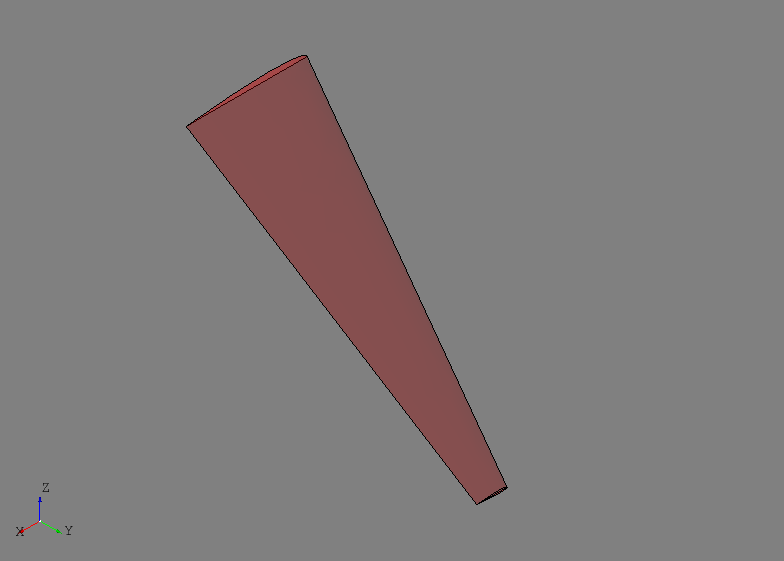

The reference surface of the wing in this case is lofted through the chord
lines of each wing section and provides the basis for the parametric (i.e, uv)
definition of the wing. For this particular model, the u-direction will
correspond to chord and v-direction will correspond to span. The leading edge
will be at u=0 and the trailing edge at u=1, while the root is at v=0 and the
tip at v=1. This is not an absolute rule and is completely dependent on the
underlying surface set as the wing's reference surface. This flexibility was
left open in case different users found other parametrization techniques more
intuitive or suitable for a given application.

To provide model organization, three different :class:`.Group` entities are
created using the :class:`.GroupAPI` tool:

.. code-block:: python

    wingbox = GroupAPI.create_group('wing box')
    spars_assy = wingbox.create_subgroup('spar assy', active=True)
    ribs_assy = wingbox.create_subgroup('rib assy', active=False)

The ``wingbox`` will be the top-level group and sub-groups for the spars
and ribs are created as shown. Note that the spar assembly was set
``active=True`` while the rib assembly was ``False``. When a :class:`.Part` is
created it is by default placed in the active :class:`.Group` if one was
not provided. Since spars are the first items created in this example, the
spar assembly was made active. The :class:`.Group` can also be supplied to the
:class:`.Part` builder tool directly.

A front spar is defined in the parametric domain of the wing using its
reference surface and the :class:`.SparByParameters` tool::

    fspar = SparByParameters('fspar', 0.15, 0.1, 0.15, 0.98, wing).part

Note that the *uv* parameters are relative to the reference surface of the
:class:`.Body` supplied to this tool. This tool, and others like it, are
designed to operate as described in Step 1 above and generate the initial
shape of the part. The initial shape is formed by simply finding the
intersecting material between the :class:`.Body` solid and a basis shape. The
:class:`.SparByParameters` tool, and others like it, can usually be initialized
with an optional ``basis_shape`` input. If provided, this basis shape will be
used to find the initial part shape and has few limitations (i.e., could be
curvilinear). If a basis shape is not provided, for this tool a plane is
automatically defined between two points on the wing reference surface defined
by the *uv* parameters and a third which is offset in the normal direction at
the (*u1*, *v1*) location. This approach usually results in a reasonable
orientation of a planar part in case the wing is twists or changes dihedral.
This is another reason why is it usually good practice, if not required, to
provide define and attach a reference surface to the input :class:`.Body`.

At this point the initial shape may extend beyond the anticipated start and end
locations since the process has simply found an intersection between the wing
solid and a plane. Not trimming the actual shape to its start and end locations
is done because: 1) the interfacing parts and shapes are not yet defined and
2) because no assumption is made about the shape of the interfacing structure.
Point 2 is particularly important because although assumptions could be made
and the shape trimmed with a plane at the start and end points based on the
*uv* parameters for example, it is important to keep it general in case the
interfacing structure is actually some curvilinear shape that is not
yet defined (e.g., a bulkhead in a fuselage).

Although the part shape is not initially trimmed, having some way of tracking
where it will generally start and stop is a valuable reference. In the case
of the front spar, this is accomplished by building and associating a
:class:`.Part` *reference curve* within the :class:`.SparByParameters` process.
This reference curve is constructed by intersecting the wing's reference
surface with the part's basis shape (a default plane in this case). The
resulting intersection is converted into a :class:`.TrimmedCurve` entity.
Initially this curve also extends the full length of the reference surface, but
the points defined by the *uv* parameters are used to bound the curve. These
points and the trimmed curve represent a planform view of where the part will
generally start and end on the wing, even though the spar's shape at this point
still extends the full volume. The initial part shape, its reference curve
(shown in red), and its start and end points (shown in yellow) are shown below.

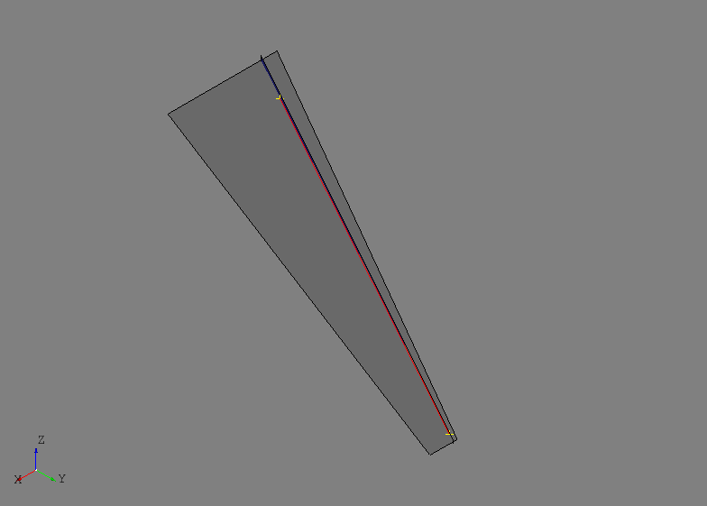

The rear spar is defined using the same tool but at 65% chord::

    rspar = SparByParameters('rspar', 0.65, 0.1, 0.65, 0.98, wing).part

The initial shapes of the front and rear spar as well as their reference
geometry are shown below.

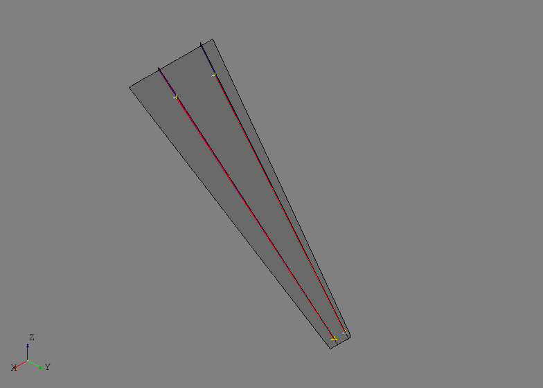

After activating the ribs assembly, ribs will be defined at the root and tip of
the front and rear spars using the :class:`.RibByPoints` tool. In this tool,
start and end points are given instead of parameters on the wing reference
surface. Although, these points should generally lie close to or on the wing's
reference surface because the tool simply inverts them to find *uv* parameters
and then uses the :class:`.RibByParameters` tool. The root and tip ribs are
defined as:

.. code-block:: python

    root = RibByPoints('root', fspar.cref.p1, rspar.cref.p1, wing).part
    tip = RibByPoints('tip', fspar.cref.p2, rspar.cref.p2, wing).part

The root and tip ribs are shown below along with their reference geometry.

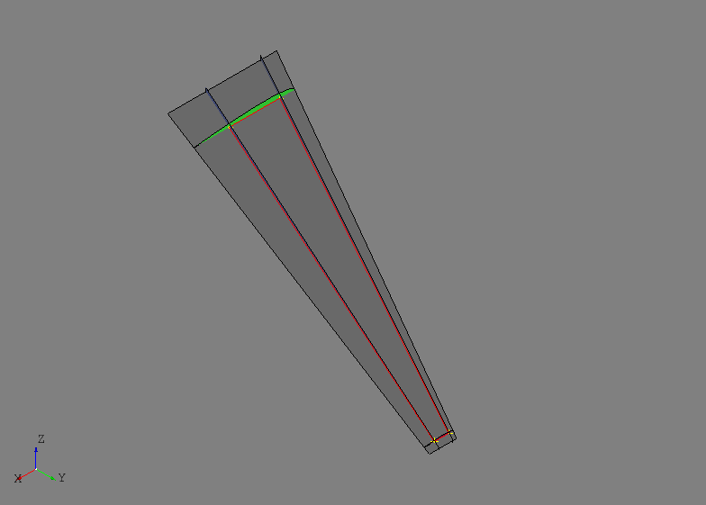

Generating multiple intermediate ribs between the root and tip will be
accomplished using the :class:`.RibsAlongCurveByDistance` tool. This tool
uses a curve and a spacing to distribute planes along the curve that become
the basis shapes for the ribs. The parameters ``shape1`` and ``shape2`` define
the start and end points for the rib reference curves and ``d1`` and ``d2``
control initial offset spacing at the first and last points of the curve.
Additionally, a *reference plane* can be supplied using the ``ref_pln``
parameter which will define the plane orientation at each point along the
curve. If no reference plane is provided, then the first derivative of the
curve will be used to define the normal orientation of the plane.

.. code-block:: python

    ribs = RibsAlongCurveByDistance('rib', rspar.cref, 30., fspar, rspar, wing,
                                    d1=30., d2=-30.).parts

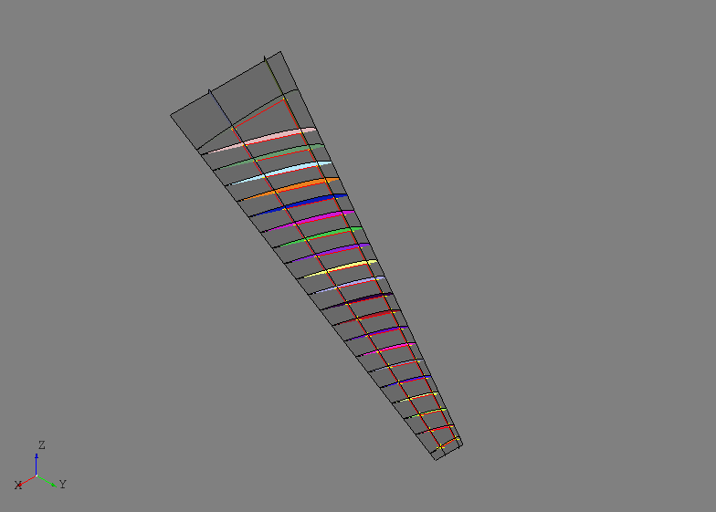

Since the rear spar reference curve was used without providing a reference
plane, this tool makes the ribs perpendicular to the rear spar. Remember that
all the images to this point show the initial part shapes without any
joining or trimming. The images may begin to look cluttered and strange, but it
will become clear in later steps how to achieve the desired result.

Simple center wing box structure will be modeled that includes a front and rear
center spar as well as some center ribs oriented in the global xz-plane. This
highlights an example where some additional thought and modeling is required
before the automated tools can be used. The end point of the front center
spar will interface with both the front spar and the root rib and therefore
should be oriented such that is intersects cleanly. If the automated tools
are used without providing a basis shape, it is likely the the automated
orientation will not line up properly with the front spar and root rib
intersection. To resolve this, the intersection between the front spar and
root rib will be used to define the basis shape of the front center spar. The
tool :class:`.PlaneByIntersectingShapes` will return a plane based on the
intersection of the two shapes if the edges of the resulting intersection are
planar. To fully define the plane, a third reference point is needed that is
not collinear with the intersection and is usually the other point of the
structure being defined. The same process is done for the rear center spar and
the results are shown below.

.. code-block:: python

    # Front center spar
    p1 = wing.sref.eval(0.25, .0)
    pln = PlaneByIntersectingShapes(fspar.shape, root.shape, p1).plane
    fcspar = SparByPoints('fcspar', p1, root.cref.p1, wing, pln).part

    # Rear center spar
    p1 = wing.sref.eval(0.75, .0)
    pln = PlaneByIntersectingShapes(rspar.shape, root.shape, p1).plane
    rcspar = SparByPoints('rcspar', p1, root.cref.p2, wing, pln).part

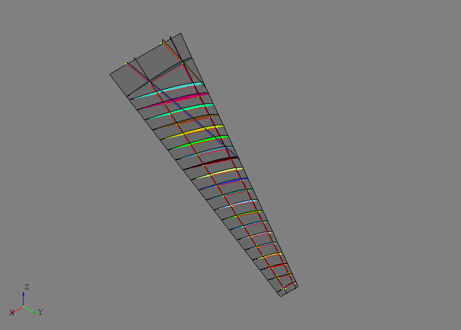

Center wing box ribs are added using the :class`.RibsAlongCurveByNumber` tool
and this time a basis shape (the xz-plane) will be supplied.

.. code-block:: python

    ref_pln = PlaneByAxes(origin=(0., 0., 0.), axes='xz').plane
    ribs = RibsAlongCurveByNumber('center rib', rcspar.cref, 3, fcspar, rcspar,
                                  wing, ref_pln, d1=6, d2=-18).parts

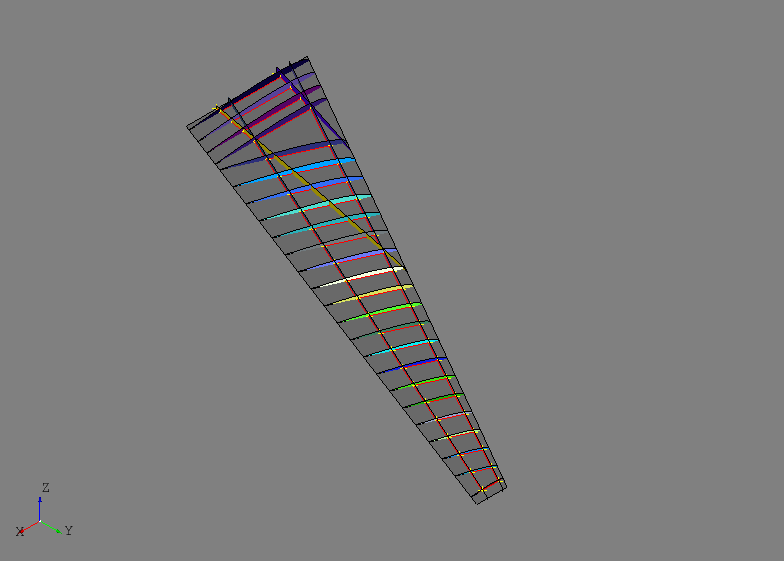

At this point it is helpful to plot only the wing reference surface and the
reference curves of each of the parts defined thus far. This will be a helpful
representation of how the structure will generally look at the end of the
process.

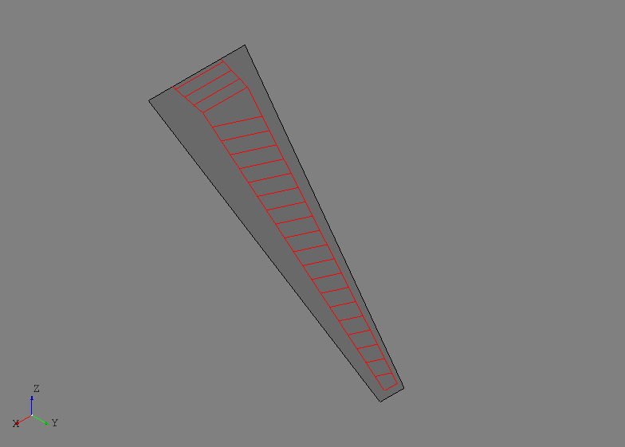

Joining the internal structure can now be done using a specialized
:class:`.FuseSurfacePartsByCref` tool. This tool will take a sequence of
:class:`.SurfacePart` entities and join them only if their reference curves
intersect. With this tool, even though the initial shapes may visually
intersect in undesired regions, the reference curves are used as a way to
intelligently select which parts should actually be topologically joined with
one another.

.. code-block:: python

    internal_parts = wingbox.get_parts()
    FuseSurfacePartsByCref(internal_parts)

It may not be obvious in the image below, but after the joining operation new
edges only exist between the parts that had intersecting reference curves.

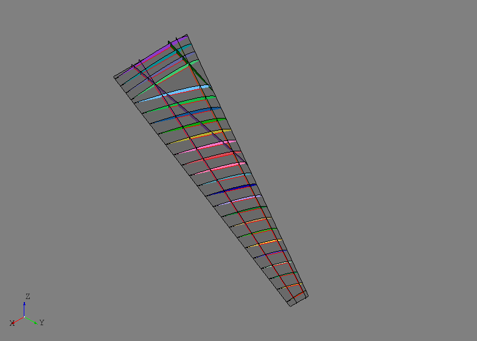

After the joining operation the initial shapes have been updated with new
shapes that are now trimmed with the other parts and should share congruent
edges. Although, there are still some regions of some of the parts that must
be discarded in this example to get the desired result. In an interactive
GUI, this would be accomplished by a simple point-and-click delete operation.
Since AFEM is most likely operating in an automated and scripted
environment, other means of replicating the point-and-click action must be
developed. In this example the :class:`.DiscardByCref` tool is used::

    DiscardByCref(internal_parts)

For each part in the input, this will try and determine which sub-shapes should
be discarded (i.e., deleted) based on their relationship to the reference curve
of the part. At each end of the part reference curve, the first derivatives of
the curve are used to define normal directions for two planes located at the
start and end points. These planes and their normal direction attempt to define
the "outside" region of the part. For each relevant sub-shape, which will be
the edges of a :class:`.CurvePart` or faces of a :class:`.SurfacePart`, the
centroid of the shape will be classified as either "inside" or "outside" the
part based on its location relative to the two planes. If the centroid is
classified as outside then the sub-shape is removed and the part shape is
updated. This method and tool are based on some assumptions about the general
part shape and it having a reference curve. There are other discarding tools
available for general or complex cases. The result after discarding faces of
the internal structure based on their reference curves is shown below along
with one of the "outside" regions for one of the ribs. Note that the regions
are drawn as finite boxes, but they are actually infinite boxes in the
direction away from the part reference curve.

.. image:: ./resources/structure_basic10.png

After the internal structure is defined and joined, the next step is usually
initializing any external skins and joining them with the internal structure.
The :class:`.SkinByBody` extract the outer shell from a solid and uses that
as the shape for a :class:`.Skin` entity::

    skin = SkinByBody('skin', wing).part

The `skin.fuse(other_parts)` will join the input parts with the skin but it
does not check or join the input parts with one another. This is the desired
behavior since they have already been joined::

    skin.fuse(*internal_parts)

Joining the external skin with all the internal structure at once improves the
chances of obtaining congruent edges between all the interfacing structure. It
is generally recommended that joining of external skins to internal structure
is saved for later in the geometric modeling process. The skin and internal
structure are shown below.

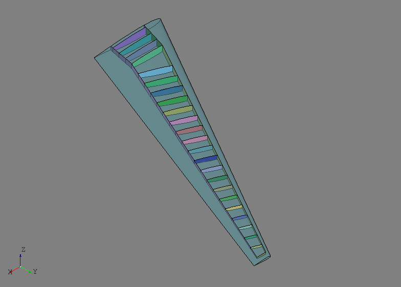

For this example, the wing skin regions outside the primary load-carrying area
of the wing box are to be excluded::

    skin.discard_by_dmin(wing.sref, 1.)

This method will check each sub-shape of the part for its distance to some
reference entity, in this case the wing reference surface. If the distance is
below some threshold then the sub-shape is discarded from the part. For this
model, any skin region that touches the wing reference surface is either along
the leading or trailing edge and outside the primary load-carrying area. The
resulting wing box is shown below.

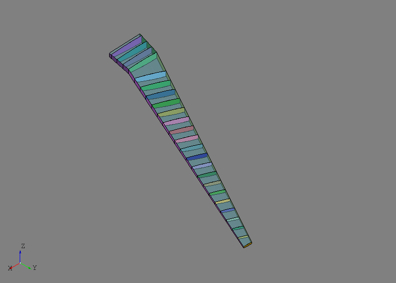

In the example, the ``skin.fix()`` method is used to check the shape of the
skin. This method is a general shape checking and fixing tool that can catch
and repair errors that may arise during the modeling process. In this case,
the skin was originally a single :class:`.Shell`, but after joining and
discarding become two disconnected shapes, one upper and one lower. To remedy
this, the ``skin.fix()`` repaired the shape by changing its type to a
:class`.Compound` made up of two :class:`.Shell` entities.

At this point the geometric modeling process is complete and the following
code will check the shape for any free edges which may indicate an error. The
``shape`` variable below is a single top-level shape put together from all of
the parts.

.. code-block:: python

    shape = GroupAPI.get_shape()
    tool = ExploreFreeEdges(shape)

The free edges of ``tool`` are shown below with the checked geometry. Note that
the only free edges (shown in red) found were along the root of the model which
is expected since now structure was modeled there.

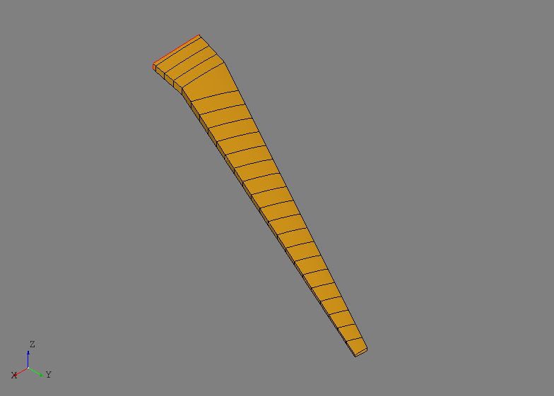

The next step is the process is usually the generation of Finite Element Model
(FEM) data. For this task, AFEM focuses on providing the needed level of
access to the various shapes of the model to conveniently apply meshing
controls. Rules and best practices for airframe meshing are typically dependent
on the application (e.g., loads vs. deflection model) and/or the user's own
experience and heuristics. Developing fully-automated, widely applicable, and
robust rules for meshing was deemed impractical and outside the scope of this
project. Instead, effort was directed towards developing streamlined tools to
enable the user to efficiently define their own controls. The low-level
meshing controls are best described in the ``afem.smesh`` documentation.

For this example, the :class:`.MeshVehicle` tool provides a convenient API to
define and apply both global and local meshing controls to the desired regions.
The :class:`.MeshVehicle` tool is not a one-size-fits all tool, but is more
an example of a meshing utility that could be developed for more advanced use
cases. Although, it does provide a wide range of functionality all in one
place::

    mesh = MeshVehicle(4.)

Upon initialization, this tool will define a top-level global shape derived
from the *master* group from the :class:`.GroupAPI` tool. The ``target_size``
parameter is used to define a global quad-dominated meshing algorithm that will
be applied to the entire shape absent of any other local mesh controls.

This simple example is actually suited for more of a structured meshing
approach with the right local edge meshing controls. The code below gathers
parts of specific types together and then the :class:`.ExploreParts` tool is
used to retrieve a :class:`.Compound` that contains only the shared edges.
Here, the edges shared by both the spars and skin will have a maximum edge
length of four.

.. code-block:: python

    spars = wingbox.get_parts(rtype=Spar)
    skins = wingbox.get_parts(rtype=Skin)
    shape = ExploreParts.shared_edges(spars, skins, True)
    mesh.set_max_length_1d(4., shape)

In similar fashion, the shared edges between the ribs and spars will have four
elements along their length.

.. code-block:: python

    ribs = wingbox.get_parts(rtype=Rib)
    shape = ExploreParts.shared_edges(spars, ribs, True)
    mesh.set_number_segments_1d(4, shape)

Next, the edges shared between the ribs and the skin will have fifteen elements
along their length.

.. code-block:: python

    shape = ExploreParts.shared_edges(skins, ribs, True)
    mesh.set_number_segments_1d(15, shape)

Since these controls provide a fairly structured 1-D meshing pattern, a
structured quadrilateral algorithm will be applied to all the applicable faces
of the model.

.. code-block:: python

    for part in wingbox.get_parts():
        mesh.set_quadrangle_2d(part.shape)

Finally, the mesh can be computed::

    mesh.compute()

The nearly all structured quadrilateral mesh is shown below.

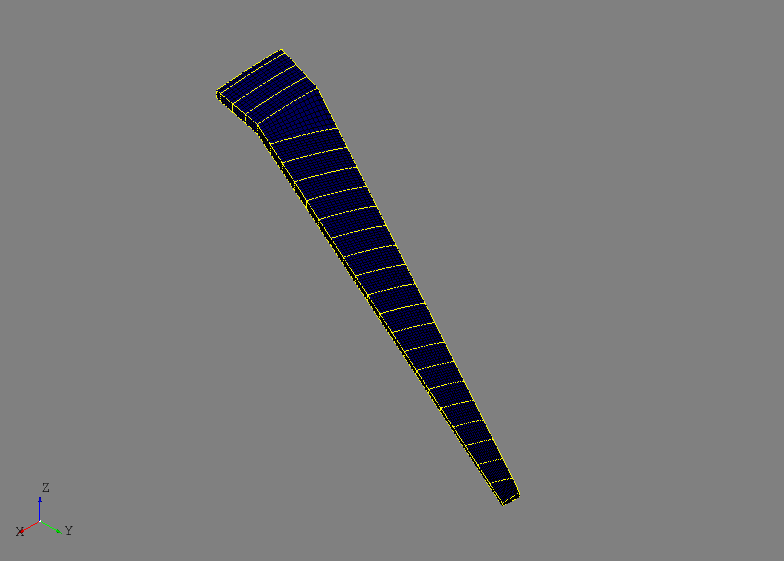

A convenient way to work with the mesh data is to create mesh groups for
different mesh types (e.g., node, edge, or face). Mesh groups can be created
before the mesh is computed and are derived and associated to a shape. Node
groups for the spars and ribs can be defined by:

.. code-block:: python

    spar_nodes = mesh.create_node_group(spars_assy.get_shape())
    rib_nodes = mesh.create_node_group(ribs_assy.get_shape())

The nodes in these groups are shown below.

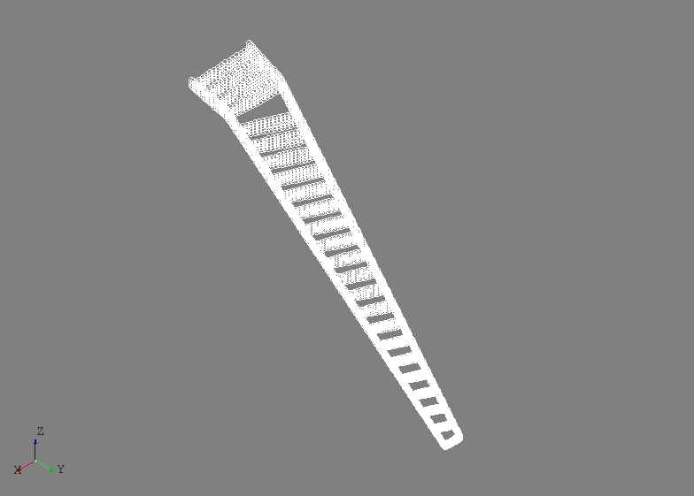

Useful information can be derived from these mesh groups like the shared nodes
between two different groups. In this example, the shared nodes between the
spars and ribs can be obtained by an intersection algorithm::

    shared_nodes = spar_nodes.intersect(rib_nodes, 'spar and rib nodes')

The shared nodes are shown below. The same could be done for mesh edge groups
created from the same parts.

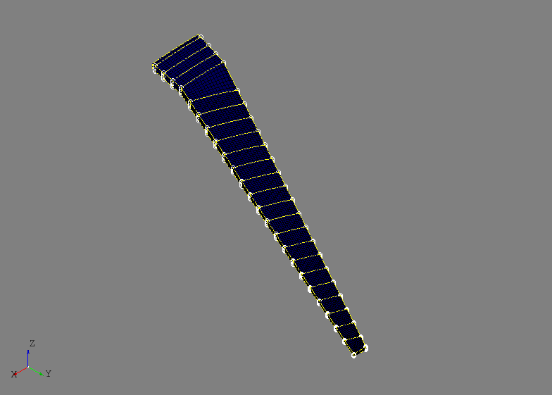

Mesh edge groups can created from the front spar and the wing skin and shared
edges are calculated by:

.. code-block:: python

    fspar_edges = mesh.create_edge_group(fspar.shape)
    skin_edges = mesh.create_edge_group(skin.shape)
    shared_edges = skin_edges.intersect(fspar_edges)

This could be one way of extract spar cap elements from the mesh and assigning
FEM properties in downstream properties. The shared mesh edges are shown below.

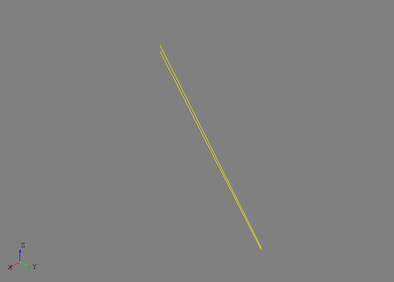

As a last example, the experimental Nastran export tool can be accessed from
the :class:`.MeshVehicle` tool to output the entire mesh to a Nastran bulk
data file::

    mesh.export_nastran('structure_basic.bdf')

To date, no materials or element properties are include in AFEM so this file
only contains the nodes and elements. Although, this could be part of future
development.

Entities
--------
.. py:currentmodule:: afem.structure.entities

Part
~~~~
.. autoclass:: Part

CurvePart
~~~~~~~~~
.. autoclass:: CurvePart

Beam1D
~~~~~~
.. autoclass:: Beam1D

SurfacePart
~~~~~~~~~~~
.. autoclass:: SurfacePart

WingPart
~~~~~~~~
.. autoclass:: WingPart

Spar
~~~~
.. autoclass:: Spar

Rib
~~~
.. autoclass:: Rib

FuselagePart
~~~~~~~~~~~~
.. autoclass:: FuselagePart

Bulkhead
~~~~~~~~
.. autoclass:: Bulkhead

Floor
~~~~~
.. autoclass:: Floor

Frame
~~~~~
.. autoclass:: Frame

Skin
~~~~
.. autoclass:: Skin

Stiffener1D
~~~~~~~~~~~
.. autoclass:: Stiffener1D

Stiffener2D
~~~~~~~~~~~
.. autoclass:: Stiffener2D

Stringer
~~~~~~~~
.. autoclass:: Stringer

Beam2D
~~~~~~
.. autoclass:: Beam2D

Group
~~~~~
.. autoclass:: afem.structure.group.Group

GroupAPI
~~~~~~~~
.. autoclass:: afem.structure.group.GroupAPI

Create
------
.. py:currentmodule:: afem.structure.create

PartBuilder
~~~~~~~~~~~
.. autoclass:: PartBuilder

PartsBuilder
~~~~~~~~~~~~
.. autoclass:: PartsBuilder

CurvePartByShape
~~~~~~~~~~~~~~~~
.. autoclass:: CurvePartByShape

Beam1DByShape
~~~~~~~~~~~~~
.. autoclass:: Beam1DByShape

Beam1DByCurve
~~~~~~~~~~~~~
.. autoclass:: Beam1DByCurve

Beam1DByPoints
~~~~~~~~~~~~~~
.. autoclass:: Beam1DByPoints

SurfacePartByShape
~~~~~~~~~~~~~~~~~~
.. autoclass:: SurfacePartByShape

SurfacePartByParameters
~~~~~~~~~~~~~~~~~~~~~~~
.. autoclass:: SurfacePartByParameters

SurfacePartByPoints
~~~~~~~~~~~~~~~~~~~
.. autoclass:: SurfacePartByPoints

SurfacePartByEnds
~~~~~~~~~~~~~~~~~
.. autoclass:: SurfacePartByEnds

SurfacePartBetweenShapes
~~~~~~~~~~~~~~~~~~~~~~~~
.. autoclass:: SurfacePartBetweenShapes

SurfacePartsBetweenPlanesByNumber
~~~~~~~~~~~~~~~~~~~~~~~~~~~~~~~~~
.. autoclass:: SurfacePartsBetweenPlanesByNumber

SurfacePartsBetweenPlanesByDistance
~~~~~~~~~~~~~~~~~~~~~~~~~~~~~~~~~~~
.. autoclass:: SurfacePartsBetweenPlanesByDistance

SurfacePartsAlongCurveByNumber
~~~~~~~~~~~~~~~~~~~~~~~~~~~~~~
.. autoclass:: SurfacePartsAlongCurveByNumber

SurfacePartsAlongCurveByDistance
~~~~~~~~~~~~~~~~~~~~~~~~~~~~~~~~
.. autoclass:: SurfacePartsAlongCurveByDistance

SparByShape
~~~~~~~~~~~
.. autoclass:: SparByShape

SparByParameters
~~~~~~~~~~~~~~~~
.. autoclass:: SparByParameters

SparByPoints
~~~~~~~~~~~~
.. autoclass:: SparByPoints

SparByEnds
~~~~~~~~~~
.. autoclass:: SparByEnds

SparBetweenShapes
~~~~~~~~~~~~~~~~~
.. autoclass:: SparBetweenShapes

SparsBetweenPlanesByNumber
~~~~~~~~~~~~~~~~~~~~~~~~~~
.. autoclass:: SparsBetweenPlanesByNumber

SparsBetweenPlanesByDistance
~~~~~~~~~~~~~~~~~~~~~~~~~~~~
.. autoclass:: SparsBetweenPlanesByDistance

SparsAlongCurveByNumber
~~~~~~~~~~~~~~~~~~~~~~~
.. autoclass:: SparsAlongCurveByNumber

SparsAlongCurveByDistance
~~~~~~~~~~~~~~~~~~~~~~~~~
.. autoclass:: SparsAlongCurveByDistance

RibByShape
~~~~~~~~~~
.. autoclass:: RibByShape

RibByParameters
~~~~~~~~~~~~~~~~
.. autoclass:: RibByParameters

RibByPoints
~~~~~~~~~~~~
.. autoclass:: RibByPoints

RibBetweenShapes
~~~~~~~~~~~~~~~~
.. autoclass:: RibBetweenShapes

RibByOrientation
~~~~~~~~~~~~~~~~
.. autoclass:: RibByOrientation

RibsBetweenPlanesByNumber
~~~~~~~~~~~~~~~~~~~~~~~~~
.. autoclass:: RibsBetweenPlanesByNumber

RibsBetweenPlanesByDistance
~~~~~~~~~~~~~~~~~~~~~~~~~~~
.. autoclass:: RibsBetweenPlanesByDistance

RibsAlongCurveByNumber
~~~~~~~~~~~~~~~~~~~~~~
.. autoclass:: RibsAlongCurveByNumber

RibsAlongCurveByDistance
~~~~~~~~~~~~~~~~~~~~~~~~
.. autoclass:: RibsAlongCurveByDistance

RibsAlongCurveAndSurfaceByDistance
~~~~~~~~~~~~~~~~~~~~~~~~~~~~~~~~~~
.. autoclass:: RibsAlongCurveAndSurfaceByDistance

BulkheadByShape
~~~~~~~~~~~~~~~
.. autoclass:: BulkheadByShape

FloorByShape
~~~~~~~~~~~~
.. autoclass:: FloorByShape

FrameByPlane
~~~~~~~~~~~~~
.. autoclass:: FrameByPlane

FramesByPlanes
~~~~~~~~~~~~~~
.. autoclass:: FramesByPlanes

FramesBetweenPlanesByNumber
~~~~~~~~~~~~~~~~~~~~~~~~~~~
.. autoclass:: FramesBetweenPlanesByNumber

FramesBetweenPlanesByDistance
~~~~~~~~~~~~~~~~~~~~~~~~~~~~~
.. autoclass:: FramesBetweenPlanesByDistance

SkinBySolid
~~~~~~~~~~~
.. autoclass:: SkinBySolid

SkinByBody
~~~~~~~~~~
.. autoclass:: SkinByBody

StringerByShape
~~~~~~~~~~~~~~~
.. autoclass:: StringerByShape

Beam2DBySweep
~~~~~~~~~~~~~
.. autoclass:: Beam2DBySweep

Join
----
.. py:currentmodule:: afem.structure.join

FuseSurfaceParts
~~~~~~~~~~~~~~~~
.. autoclass:: FuseSurfaceParts

FuseSurfacePartsByCref
~~~~~~~~~~~~~~~~~~~~~~
.. autoclass:: FuseSurfacePartsByCref

CutParts
~~~~~~~~
.. autoclass:: CutParts

SewSurfaceParts
~~~~~~~~~~~~~~~
.. autoclass:: SewSurfaceParts

SplitParts
~~~~~~~~~~
.. autoclass:: SplitParts

FuseGroups
~~~~~~~~~~
.. autoclass:: FuseGroups

Modify
------
.. py:currentmodule:: afem.structure.modify

DiscardByCref
~~~~~~~~~~~~~
.. autoclass:: DiscardByCref

Explore
--------
.. py:currentmodule:: afem.structure.explore

ExploreParts
~~~~~~~~~~~~
.. autoclass:: ExploreParts

Fix
---
.. py:currentmodule:: afem.structure.fix

FixGroup
~~~~~~~~
.. autoclass:: FixGroup

Check
-----
.. py:currentmodule:: afem.structure.check

CheckPart
~~~~~~~~~
.. autoclass:: CheckPart

Mesh
----
.. py:currentmodule:: afem.structure.mesh

MeshVehicle
~~~~~~~~~~~
.. autoclass:: MeshVehicle

Utilities
---------
.. automodule:: afem.structure.utils
