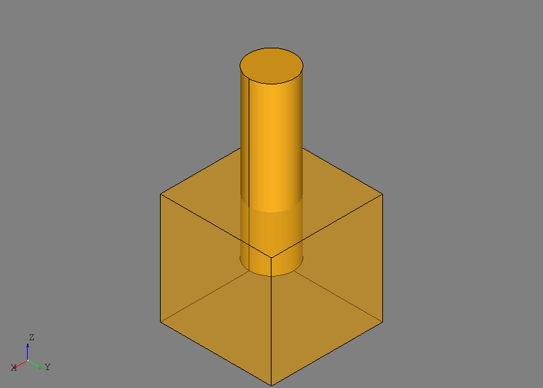
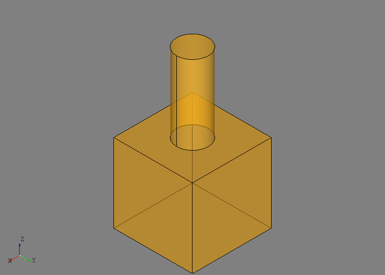
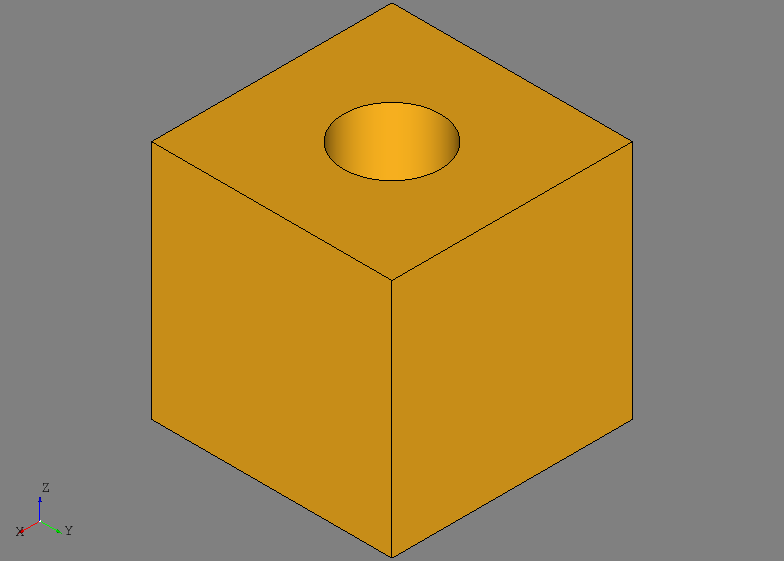
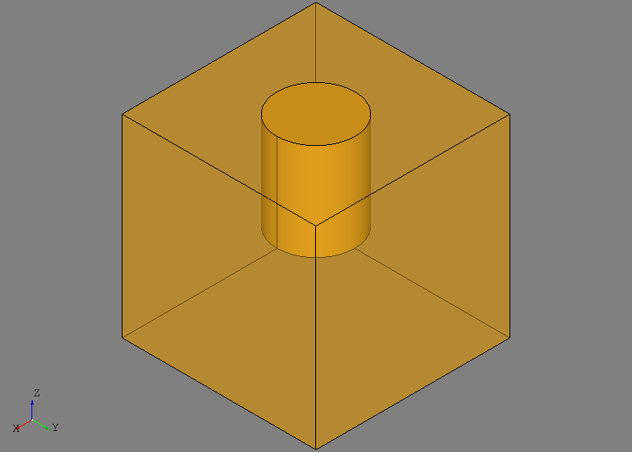
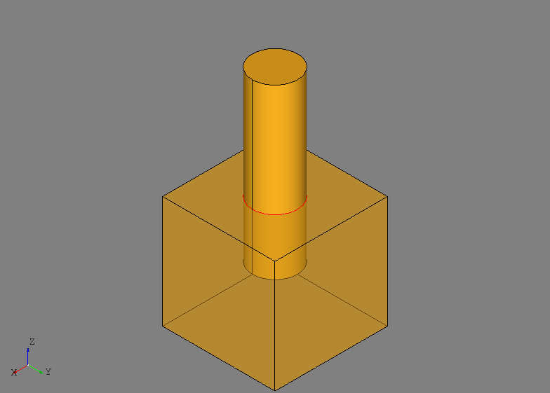
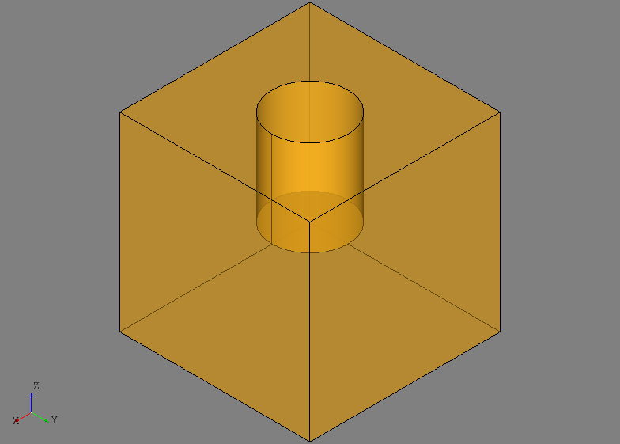
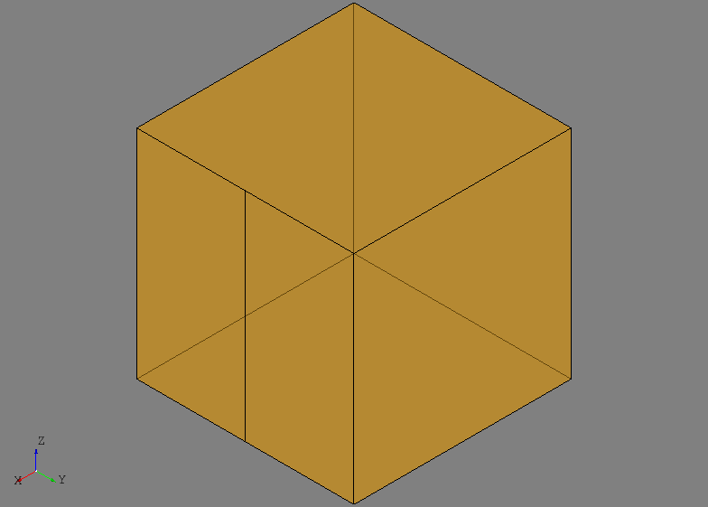

Topology
========
**NOT YET COMPLETE**

The ``afem.topology`` package provides tools for the creation and use of
OpenCASCADE topology (i.e., shapes). While geometry defines curves and
surfaces, topology describes their connectivity and boundary representation.
OpenCASCADE shapes are the core building blocks for building more complex parts
and assemblies. The topology entities and tools can be imported by::

    from afem.topology import *

The user should review the OpenCASCADE topology documentation to become with
the underlying types and data structures:

* `OpenCASCADE Reference Manual-Topology <https://www.opencascade.com/doc/occt-7.2.0/overview/html/occt_user_guides__modeling_data.html#occt_modat_5>`_

The types in ``afem.topology.entities`` are essentially wrappers of their
underlying ``TopoDS_Shape`` object. This is an attempt to provide a more
"Pythonic" interface for the OpenCASCADE ``TopoDS_Shape`` types. Many tools are
provided for the user to easily create, modify, and operate on shapes. If a
tool is not available, the user can still use the pyOCCT package and access
the wrapped ``TopoDS_Shape`` instance using the ``object`` property of
``Shape``.

A subset of ``afem.topology`` entities and tools are featured in the following
example:

.. code-block:: python

    from afem.geometry import *
    from afem.graphics import *
    from afem.topology import *

    gui = Viewer()

    # Create a box by size
    builder = BoxBySize(10, 10, 10)
    box = builder.solid
    box.set_transparency(0.5)

    # Create a cylinder partially inside the box
    circle = CircleByNormal((5, 5, 5), (0, 0, 1), 2).circle
    face = FaceByPlanarWire(circle).face
    cyl = SolidByDrag(face, (0, 0, 15)).solid

    # View the two shapes
    gui.add(box, cyl)
    gui.start()
    gui.clear()

    # Fuse the shapes
    fuse = FuseShapes(box, cyl)
    fused_shape = fuse.shape
    fused_shape.set_transparency(0.5)

    gui.add(fused_shape)
    gui.start()
    gui.clear()

    # Cut the cylinder from the box
    cut = CutShapes(box, cyl)
    cut_shape = cut.shape

    gui.add(cut_shape)
    gui.start()
    gui.clear()

    # Common material between the two shapes
    common = CommonShapes(box, cyl)
    common_shape = common.shape

    # Show original box for reference
    gui.add(common_shape, box)
    gui.start()
    gui.clear()

    # Intersect the shapes
    sec = IntersectShapes(box, cyl)
    sec_shape = sec.shape

    # Original shapes shown for reference
    gui.add(sec_shape, box, cyl)
    gui.start()
    gui.clear()

    # Split the box with the cylinder. The resulting shape is a compound with
    # two solids.
    split = SplitShapes(box, cyl)
    split_shape = split.shape
    split_shape.set_transparency(0.5)

    gui.add(split_shape)
    gui.start()
    gui.clear()

    # Locally split one face of the box with a plane
    pln = PlaneByAxes((5, 5, 5), 'xz').plane

    local = LocalSplit(builder.front_face, pln, box)
    local_shape = local.shape
    local_shape.set_transparency(0.5)

    gui.add(local_shape)
    gui.start()
    gui.clear()

    # Offset the box
    offset = OffsetShape(box, 2)
    offset_shape = offset.shape
    offset_shape.set_transparency(0.5)

    gui.add(box, offset_shape)
    gui.start()
    gui.clear()

    # Rebuild the box with the results of the cut tool.
    rebuild = RebuildShapeByTool(box, cut)
    new_shape = rebuild.new_shape

    gui.add(new_shape)
    gui.start()

    # Check the new shape for errors
    check = CheckShape(new_shape)
    print('Shape is valid:', check.is_valid)
    print('Shape type:', new_shape.shape_type)

    # Since a face is removed it is no longer a valid solid but a shell. Try to
    # fix the shape.
    fix = FixShape(new_shape)
    fixed_shape = fix.shape

    check = CheckShape(fixed_shape)
    print('Shape is valid:', check.is_valid)
    print('Shape type:', fixed_shape.shape_type)

    gui.add(fixed_shape)
    gui.start()

    # Find free edges of a shape
    tool = ExploreFreeEdges(fixed_shape)

    gui.add(*tool.free_edges)
    gui.start()

The needed entities and tools are imported by:

.. code-block:: python

    from afem.geometry import *
    from afem.graphics import *
    from afem.topology import *

A number of tools exist to create shapes but these examples the primary shapes
are a solid box and a solid cylinder. The box is created by a length, width,
and height:

.. code-block:: python

    builder = BoxBySize(10, 10, 10)
    box = builder.solid
    box.set_transparency(0.5)

The cylinder is created by extruding a circular face along a vector:

.. code-block:: python

    circle = CircleByNormal((5, 5, 5), (0, 0, 1), 2).circle
    face = FaceByPlanarWire(circle).face
    cyl = SolidByDrag(face, (0, 0, 15)).solid

The two shapes are shown below:

Boolean operations are some of the most commonly used and most powerful
modeling tools. The two shapes are fused together to form, in this case, a
single solid using the ``FuseShapes`` tool:

.. code-block:: python

    fuse = FuseShapes(box, cyl)
    fused_shape = fuse.shape

In the resulting shape, the portion of the cylinder that was inside the solid
box has been removed and the union of the box and cylinder is shown below:

The cylinder is cut from the box using the ``CutShapes`` tool:

.. code-block:: python

    cut = CutShapes(box, cyl)
    cut_shape = cut.shape

In this tool, material from ``shape2`` is cut away from ``shape1`` and the
result is shown below:

Finding common material between two shapes is done by the ``CommonShapes``
tool:

.. code-block:: python

    common = CommonShapes(box, cyl)
    common_shape = common.shape

This tool will find the material that is shared by both the box and the
cylinder, which in this case in the segment of the cylinder inside the box. The
result is shown below where the original box is shown for reference:

The intersection of shapes is done by ``IntersectShapes`` and in this case
the resulting shape is a compound of edges:

.. code-block:: python

    sec = IntersectShapes(box, cyl)
    sec_shape = sec.shape

Sometimes it's possible for the result to only contain vertices if, for
example, to edges are used in the intersection. The intersecting shape is shown
in red in the image below:

The ``SplitShapes`` tool splits arbitrary shapes with each other and in this
example is used to split the box with the cylinder:

.. code-block:: python

    split = SplitShapes(box, cyl)
    split_shape = split.shape

The resulting shape in this case in a compound consisting of two different
solids as shown below:

The ``SplitShapes`` tool is very general and can be used for splitting faces
with edges, among other applications.

In some cases it may be desirable to only split a sub-shape of a basis shape.
This example uses the ``LocalSplit`` tool to split one of the front face of the
original solid box with a plane:

.. code-block:: python

    pln = PlaneByAxes((5, 5, 5), 'xz').plane

    local = LocalSplit(builder.front_face, pln, box)
    local_shape = local.shape

The front face of the box is provided as the shape to split and the box is
provided as the "basis shape", where the shape to fit must be a sub-shape of
the basis shape. The result is still a solid but with one of the faces now
split:

The ``OffsetShape`` tool is used to offset the solid box:

.. code-block:: python

    offset = OffsetShape(box, 2)
    offset_shape = offset.shape

The resulting offset shape is shown below:

.. image:: ./resources/topology_basic8.png

The rest of the example script demonstrates rebuilding (or substituting) shapes
using specified substitutions or, in this example, the results of a Boolean
operation. The rebuilding tools may not be used that often in practice, but
set up an example of using the ``CheckShape`` and ``FixShape`` tools. Since a
face was removed from the solid, it is not longer a valid, closed solid. This
is detected by the ``CheckShape`` tool and fixed with the generic ``FixShape``
tool. In this example the only fix was just switching the type from a ``Solid``
to a ``Shell``, but they can be used to detect and fix more complicated errors
like self-intersecting shapes or improperly defined geometry.

Entities
--------
.. py:currentmodule:: afem.topology.entities

Shape
~~~~~
.. autoclass:: Shape

Vertex
~~~~~~~
.. autoclass:: Vertex

Edge
~~~~
.. autoclass:: Edge

Wire
~~~~
.. autoclass:: Wire

Face
~~~~
.. autoclass:: Face

Shell
~~~~~
.. autoclass:: Shell

Solid
~~~~~
.. autoclass:: Solid

CompSolid
~~~~~~~~~
.. autoclass:: CompSolid

Compound
~~~~~~~~
.. autoclass:: Compound

Bounding Box
~~~~~~~~~~~~
.. autoclass:: BBox

Create
------
.. py:currentmodule:: afem.topology.create

VertexByPoint
~~~~~~~~~~~~~
.. autoclass:: VertexByPoint

EdgeByPoints
~~~~~~~~~~~~
.. autoclass:: EdgeByPoints

EdgeByVertices
~~~~~~~~~~~~~~
.. autoclass:: EdgeByVertices

EdgeByCurve
~~~~~~~~~~~
.. autoclass:: EdgeByCurve

EdgeByDrag
~~~~~~~~~~
.. autoclass:: EdgeByDrag

EdgeByWireConcat
~~~~~~~~~~~~~~~~
.. autoclass:: EdgeByWireConcat

WireByEdges
~~~~~~~~~~~
.. autoclass:: WireByEdges

WiresByConnectedEdges
~~~~~~~~~~~~~~~~~~~~~
.. autoclass:: WiresByConnectedEdges

WireByPlanarOffset
~~~~~~~~~~~~~~~~~~
.. autoclass:: WireByPlanarOffset

WiresByShape
~~~~~~~~~~~~
.. autoclass:: WiresByShape

WireByPoints
~~~~~~~~~~~~~
.. autoclass:: WireByPoints

WireByConcat
~~~~~~~~~~~~
.. autoclass:: WireByConcat

FaceBySurface
~~~~~~~~~~~~~
.. autoclass:: FaceBySurface

FaceByPlane
~~~~~~~~~~~
.. autoclass:: FaceByPlane

FaceByPlanarWire
~~~~~~~~~~~~~~~~
.. autoclass:: FaceByPlanarWire

FaceByDrag
~~~~~~~~~~
.. autoclass:: FaceByDrag

ShellBySurface
~~~~~~~~~~~~~~
.. autoclass:: ShellBySurface

ShellByFaces
~~~~~~~~~~~~
.. autoclass:: ShellByFaces

ShellByDrag
~~~~~~~~~~~
.. autoclass:: ShellByDrag

ShellBySewing
~~~~~~~~~~~~~
.. autoclass:: ShellBySewing

SolidByShell
~~~~~~~~~~~~
.. autoclass:: SolidByShell

SolidByPlane
~~~~~~~~~~~~
.. autoclass:: SolidByPlane

SolidByDrag
~~~~~~~~~~~
.. autoclass:: SolidByDrag

CompoundByShapes
~~~~~~~~~~~~~~~~
.. autoclass:: CompoundByShapes

HalfspaceByShape
~~~~~~~~~~~~~~~~
.. autoclass:: HalfspaceByShape

HalfspaceBySurface
~~~~~~~~~~~~~~~~~~
.. autoclass:: HalfspaceBySurface

ShapeByFaces
~~~~~~~~~~~~
.. autoclass:: ShapeByFaces

ShapeByDrag
~~~~~~~~~~~
.. autoclass:: ShapeByDrag

BoxBuilder
~~~~~~~~~~
.. autoclass:: BoxBuilder

BoxBySize
~~~~~~~~~
.. autoclass:: BoxBySize

BoxBy2Points
~~~~~~~~~~~~
.. autoclass:: BoxBy2Points

CylinderByAxis
~~~~~~~~~~~~~~
.. autoclass:: CylinderByAxis

SphereByRadius
~~~~~~~~~~~~~~
.. autoclass:: SphereByRadius

SphereBy3Points
~~~~~~~~~~~~~~~
.. autoclass:: SphereBy3Points

PointAlongShape
~~~~~~~~~~~~~~~
.. autoclass:: PointAlongShape

PointsAlongShapeByNumber
~~~~~~~~~~~~~~~~~~~~~~~~
.. autoclass:: PointsAlongShapeByNumber

PointsAlongShapeByDistance
~~~~~~~~~~~~~~~~~~~~~~~~~~
.. autoclass:: PointsAlongShapeByDistance

PlaneByEdges
~~~~~~~~~~~~
.. autoclass:: PlaneByEdges

PlaneByIntersectingShapes
~~~~~~~~~~~~~~~~~~~~~~~~~
.. autoclass:: PlaneByIntersectingShapes

Explore
-------
.. py:currentmodule:: afem.topology.explore

ExploreWire
~~~~~~~~~~~
.. autoclass:: ExploreWire

ExploreFreeEdges
~~~~~~~~~~~~~~~~
.. autoclass:: ExploreFreeEdges

Modify
------
.. py:currentmodule:: afem.topology.modify

DivideClosedShape
~~~~~~~~~~~~~~~~~
.. autoclass:: DivideClosedShape

DivideContinuityShape
~~~~~~~~~~~~~~~~~~~~~
.. autoclass:: DivideContinuityShape

DivideC0Shape
~~~~~~~~~~~~~~~~~
.. autoclass:: DivideC0Shape

UnifyShape
~~~~~~~~~~
.. autoclass:: UnifyShape

SewShape
~~~~~~~~
.. autoclass:: SewShape

RebuildShapeWithShapes
~~~~~~~~~~~~~~~~~~~~~~
.. autoclass:: RebuildShapeWithShapes

RebuildShapeByTool
~~~~~~~~~~~~~~~~~~
.. autoclass:: RebuildShapeByTool

RebuildShapesByTool
~~~~~~~~~~~~~~~~~~~
.. autoclass:: RebuildShapesByTool

ShapeBSplineRestriction
~~~~~~~~~~~~~~~~~~~~~~~
.. autoclass:: ShapeBSplineRestriction

Boolean
-------
.. py:currentmodule:: afem.topology.bop

BopCore
~~~~~~~
.. autoclass:: BopCore

BopAlgo
~~~~~~~
.. autoclass:: BopAlgo

FuseShapes
~~~~~~~~~~
.. autoclass:: FuseShapes

CutShapes
~~~~~~~~~
.. autoclass:: CutShapes

CommonShapes
~~~~~~~~~~~~
.. autoclass:: CommonShapes

IntersectShapes
~~~~~~~~~~~~~~~
.. autoclass:: IntersectShapes

SplitShapes
~~~~~~~~~~~~
.. autoclass:: SplitShapes

VolumesFromShapes
~~~~~~~~~~~~~~~~~
.. autoclass:: VolumesFromShapes

CutCylindricalHole
~~~~~~~~~~~~~~~~~~
.. autoclass:: CutCylindricalHole

LocalSplit
~~~~~~~~~~
.. autoclass:: LocalSplit

SplitShapeByEdges
~~~~~~~~~~~~~~~~~
.. autoclass:: SplitShapeByEdges

SplitWire
~~~~~~~~~~~
.. autoclass:: SplitWire

TrimOpenWire
~~~~~~~~~~~~
.. autoclass:: TrimOpenWire

Offset
------
.. py:currentmodule:: afem.topology.offset

ProjectShape
~~~~~~~~~~~~
.. autoclass:: ProjectShape

OffsetShape
~~~~~~~~~~~
.. autoclass:: OffsetShape

LoftShape
~~~~~~~~~
.. autoclass:: LoftShape

SweepShape
~~~~~~~~~~
.. autoclass:: SweepShape

SweepShapeWithNormal
~~~~~~~~~~~~~~~~~~~~
.. autoclass:: SweepShapeWithNormal

Distance
--------
.. py:currentmodule:: afem.topology.distance

DistanceShapeToShape
~~~~~~~~~~~~~~~~~~~~
.. autoclass:: DistanceShapeToShape

DistanceShapeToShapes
~~~~~~~~~~~~~~~~~~~~~
.. autoclass:: DistanceShapeToShapes

Fix
---
.. py:currentmodule:: afem.topology.fix

FixShape
~~~~~~~~
.. autoclass:: FixShape

Properties
----------
.. py:currentmodule:: afem.topology.props

ShapeProps
~~~~~~~~~~
.. autoclass:: ShapeProps

LinearProps
~~~~~~~~~~~
.. autoclass:: LinearProps

SurfaceProps
~~~~~~~~~~~~
.. autoclass:: SurfaceProps

VolumeProps
~~~~~~~~~~~
.. autoclass:: VolumeProps

LengthOfShapes
~~~~~~~~~~~~~~
.. autoclass:: LengthOfShapes

AreaOfShapes
~~~~~~~~~~~~
.. autoclass:: AreaOfShapes

Check
-----
.. py:currentmodule:: afem.topology.check

CheckShape
~~~~~~~~~~
.. autoclass:: CheckShape

ClassifyPointInSolid
~~~~~~~~~~~~~~~~~~~~
.. autoclass:: ClassifyPointInSolid

Transform
---------
.. automodule:: afem.topology.transform